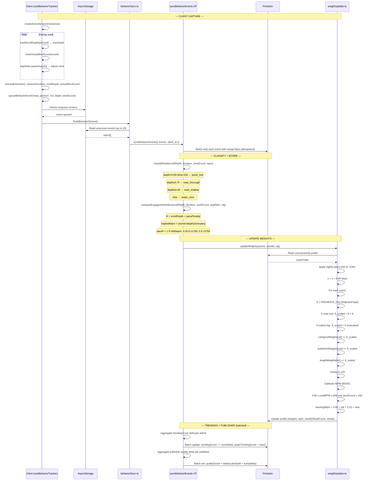

# SubTick — Article Lifecycle: End-to-End Technical Architecture

> **Scope:** Backend systems, serverless functions, Firestore schemas, mathematical models, state transitions, and scoring algorithms. Client-side UI rendering, styles, navigation, and view components are excluded.

---

## Table of Contents

- [Section A: The Lifecycle of an Article (Ingestion to Archive)](#section-a-the-lifecycle-of-an-article-ingestion-to-archive)
- [Section B: The State Update Loop (Continuous Learning)](#section-b-the-state-update-loop-continuous-learning)
- [Section C: Candidate Pool Generation & Scoring Math](#section-c-candidate-pool-generation--scoring-math)
- [Section D: The Selection & Assembly Pass (Pillar C)](#section-d-the-selection--assembly-pass-pillar-c)
- [Section E: Complete Visual Flowcharts (Mermaid.js)](#section-e-complete-visual-flowcharts-mermaidjs)

---

## Section A: The Lifecycle of an Article (Ingestion to Archive)

### A.1 — Triggering and Feed Loading

**Source file:** `firebase/functions/src/rssCollector.ts`

The `rssCollector` Cloud Function is triggered every 3 hours via Firebase Scheduler:

```typescript
export const rssCollector = onSchedule({ schedule: 'every 3 hours', memory: '512MiB' }, async () => {
  await collectRssFeeds();
});
```

Internally, `collectRssFeeds()`:

1. Loads all active feeds from the Firestore collection `feeds`. Falls back to the static `SUBSTACK_FEEDS` array in `constants.ts` (42 curated feeds across 9 categories) if Firestore returns zero documents.

2. Filters for `isActive !== false` and `forceArchived !== true` (force-archived feeds are still processed for article archiving but their items are always skipped).

3. Partitions the resulting feed list into chunks of 5 via `chunkArray(feedsList, 5)` to keep connection concurrency manageable.

4. For each feed, the URL may be prefixed with `https://rss-fetcher-zeta.vercel.app/?url=` if the `TANGENT_RSS_FETCHER` environment variable is true — an optional Vercel-side proxy.

### A.2 — RSS Parsing and Item Extraction

For each feed:

```typescript
const parser = new Parser({ timeout: 15000, headers: { 'User-Agent': 'SubTick/1.0 RSS Collector' } });
const feedData = await parser.parseURL(fetchUrl);
```

The parser supports RSS 2.0 and Atom. Each feed item is extracted for:
- `title` (cleaned: HTML entities decoded, whitespace normalized)
- `link` (the canonical article URL)
- `guid` (preferred RSS identifier; falls back to `link`)
- `pubDate` (parsed into ms; falls back to `Date.now()` on failure)
- `content:encoded` → preferred full-text HTML
- `content` / `content:itched` → secondary fallback
- `description` → summary snippet if no full text
- `creator` (Dublin Core) or `author` field
- `enclosure.url` → header image candidate

### A.3 — Substack Link Re-writing

When the feed URL includes `substack.com`, all relative and Substack-canonical image/link URLs are rewritten:

```typescript
if (fetchUrl.includes('substack.com')) {
  // Convert relative /api/v1/... images to absolute https://substack.com/api/v1/...
  // Expand internal /p/... links to canonical substack.com/p/... form
}
```

### A.4 — Batch Existence Check (Single Round-Trip)

All candidate article IDs are computed from `SHA-256(url::title)`:

```typescript
const hash = createHash('sha256').update(`${url}::${title}`).digest('hex');
const articleId = `article_${hash.substring(0, 16)}`;
```

A single `db.getAll(...articleRefs)` batch call checks existence for all items before any writes. Items whose document already exists are skipped entirely, and their GUIDs are added to `activeGuids` (the set of items still present in the live feed).

### A.5 — Paywall Detection

Before writing, every article's HTML body is scanned against `PAYWALL_KEYWORDS` (24 patterns in `constants.ts`): `To read this post, subscribe`, `Paid subscription required`, `This post is for paid subscribers`, `Upgrade to paid`, `Subscribe to continue reading`, etc.

Additional heuristics scan for CSS classes/properties matching `paywall*`, `subscribe*`, `cta*`, `upgrade*`, or HTML elements with `data-paywall`, `data-subscribe`. Paywalled articles are silently counted (`totalPaywalledSkipped`) and **never written to Firestore**.

### A.6 — OG Metadata Fallback Scrape

If the RSS feed doesn't provide a `headerImageUrl`, `description`, or `author`, the function performs a live HTTP fetch of the article URL with a 6-second abort timeout:

```typescript
async function fetchOgMetadata(url: string): Promise<OgMetadata> {
  // Fetches the live page with Mozilla/5.0 UA, 6s abort
  // Extracts: og:image, og:description / twitter:description / name=description,
  //           author / article:author, og:title (fallback)
  // All HTML entities decoded. Description truncated to 300 characters.
}
```

### A.7 — Field Computation and Storage

**Length style classification:**

| Word Count | `lengthStyle` | `estimatedReadMinutes` |
|---|---|---|
| `< 800` | `short` | `ceil(wc/250)` |
| `800–2000` | `medium` | `ceil(wc/250)` |
| `> 2000` | `long` | `ceil(wc/250)` |

**`wordCount`:** extracted from HTML via `stripTags().split(/\s+/).length`. Falls back to 0 if extraction fails; articles with `wordCount === undefined` are treated as ≥150 by the candidate pool (never filtered).

**Complete document written to `articles/{articleId}`:**

| Field | Type | Initial Value | Source |
|---|---|---|---|
| `id` | `string` | `article_${sha256::16}` | Computed |
| `title` | `string` | Cleaned item title | RSS item |
| `author` | `string` | Creator/Author field or OG metadata | RSS + scrape |
| `publicationName` | `string` | Feed's publication name | Feed config |
| `publicationUrl` | `string` | Item link | RSS item |
| `feedUrl` | `string` | Feed URL | Feed config |
| `category` | `string` | Feed's assigned category | Feed config |
| `lengthStyle` | `short\|medium\|long` | Computed from wordCount | Computed |
| `publishDate` | `number` | ms timestamp | RSS item |
| `cacheTimestamp` | `number` | `Date.now()` | System |
| `isPaywalled` | `boolean` | `false` (always) | — |
| `trendingScore` | `number` | `0` | System |
| `peakTrendingScore` | `number` | `0` | System |
| `qualityScore` | `number` | `feed.qualityScore` (default 0.80) | Feed config |
| `isSeed` | `boolean` | `false` | System |
| `rssStatus` | `'current'\|'archived'` | `'current'` (or `'archived'` if forceArchived) | System |
| `isFresh` | `boolean` | `publishDate >= now - 28days` | Computed |
| `random_score` | `number` | `Math.random()` (~Uniform[0,1)) | System |

### A.8 — Delta-Driven Archive Synchronization

After processing all items for a feed, the function determines which formerly-active articles have been removed from the live feed:

```typescript
// Query: articles WHERE feedUrl == feed.url AND rssStatus == 'current'
// For each doc: if doc.data().guid is NOT in activeGuids → update rssStatus to 'archived'
```

For `forceArchived === true` feeds, ALL current articles are archived regardless of GUID presence.

### A.9 — Daily Trending Score Decay: `cronDecayTrendingScores`

**Source file:** `firebase/functions/src/getRankedFeed.ts` (scheduled, runs every 24 hours)

**Step 1 — Decay all trendingScores:**

Iterates all articles in batches of 500. Each article's `trendingScore` is multiplied by the decay constant:

```
trendingScore_new = trendingScore × TRENDING_DECAY_RATE
TRENDING_DECAY_RATE = 0.9057
```

Effect over multiple days:

| Days elapsed | Multiplier | Retention |
|---|---|---|
| 1 | 0.9057¹ = 0.9057 | 90.6% |
| 7 | 0.9057⁷ ≈ 0.508 | 50.8% |
| 14 | 0.9057¹⁴ ≈ 0.258 | 25.8% |
| 30 | 0.9057³⁰ ≈ 0.052 | 5.2% |

**Step 2 — Refresh random_score for candidate pool re-scrambling:**

Every article's `random_score` is replaced with a fresh `Math.random()` call. This is a zero-cost operation piggybacked on the batch write, reseeding the uniform lottery that `cronUpdateCandidatePool` samples from.

**Step 3 — Update `isFresh` sticker:**

`isFresh = (publishDate >= Date.now() - 28 * 24 * 60 * 60 * 1000)` — recomputed every cycle.

### A.10 — Garbage Collection: `cronCleanupOldArticles`

**Source file:** `firebase/functions/src/getRankedFeed.ts` (scheduled, runs every 72 hours)

**Step 1 — Purge all paywalled articles:**

Queries `articles WHERE isPaywalled == true` and deletes all matching documents in batches of 500. Paywalled articles are never shown to users and never enter candidate pools.

**Step 2 — Purge bottom 3% of old articles by `peakTrendingScore`:**

```typescript
const THREE_MONTHS_MS = 90 * 24 * 60 * 60 * 1000;
const SAMPLE_LIMIT = 500;
const DELETE_FRACTION = 0.03;

// Query: articles WHERE publishDate < now - 90 days
//        ORDER BY peakTrendingScore ASC LIMIT 500
```

This query hits a composite index `(publishDate, peakTrendingScore)` and always reads **exactly 500 documents** regardless of total collection size — a fixed cost per run.

```typescript
const deleteCount = Math.max(1, Math.floor(oldArticles.length * DELETE_FRACTION));
const toDelete = oldArticles.slice(0, deleteCount); // Bottom 3%
```

The `peakTrendingScore` **never decays** (unlike `trendingScore`), so it serves as a permanent quality signal. The bottom 3% of the 500 oldest articles are deleted — a maximum of 15 per run, every 72 hours.

---

## Section B: The State Update Loop (Continuous Learning)

### B.1 — Client-Side Telemetry Capture

**Source files:** `src/hooks/useBehaviorTracker.ts`, `src/utils/activeSessionTimer.js`, `src/services/behaviorSync.ts`

When a user opens an article in the Reader, the `useBehaviorTracker` hook creates an `ActiveSessionClock`:

```javascript
// activeSessionTimer.js
function createActiveSessionClock(now) {
  return { startTime: now, pausedAt: null };
}
```

**Active time tracking** subtracts background/app-inactive intervals:

```javascript
function pauseActiveSession(clock, now) {
  if (clock.pausedAt === null) clock.pausedAt = now;
}
function resumeActiveSession(clock, now) {
  if (clock.pausedAt === null) return;
  clock.startTime += Math.max(0, now - clock.pausedAt);
  clock.pausedAt = null;
}
function getActiveSessionDuration(clock, now) {
  const ongoingPause = clock.pausedAt === null ? 0 : Math.max(0, now - clock.pausedAt);
  return Math.max(0, now - clock.startTime - ongoingPause);
}
```

AppState changes (`'active'` → `'inactive'` / `'background'`) trigger pause/resume automatically. Scroll tracking: `trackScrollDepth(depth)` updates `maxDepth = Math.max(maxDepth, depth)` on every scroll event.

**Article exit (`concludeSession`):** Emits a `read_session` event with `sessionDuration` (ms of active time), `scrollDepth` (max scroll fraction [0,1]), and optional `actualWordCount`.

### B.2 — Client-Side Queue and Flush

**Source file:** `src/services/behaviorSync.ts`

Events are written to `AsyncStorage` under key `@subtick_behavior_queue` atomically via a mutex (`createStorageMutex`). The queue caps at `MAX_QUEUE_SIZE = 500` (oldest unsynced evicted). `flushBehaviorQueue()` reads up to `SYNC_BATCH_SIZE = 20` unsynced events, calls `syncBehaviorEvents` Cloud Function, and marks synced events. Multiple lifecycle triggers share one in-flight upload promise.

### B.3 — Server-Side Event Ingestion: `syncBehaviorEvents`

**Source file:** `firebase/functions/src/syncBehaviorEvents.ts`

**Deduplication:** Each event's `id` (client-generated UUID) is used as the Firestore document ID in `users/{userId}/behavior_events/{eventId}`. The `db.batch().set(..., { merge: false })` ensures idempotency — retries never duplicate.

**Validation:** Every event is scrubbed for type (`BehaviorEventType` union), field presence, length bounds, and numeric finiteness.

### B.4 — Classifying Read Sessions

**Source file:** `firebase/functions/src/scoringConfig.ts` → `classifyRead()`

```typescript
export function classifyRead(cfg, scrollDepth, _sessionDurationMs, ...) {
  if (scrollDepth < cfg.classification.quickExitDepth &&
      _sessionDurationMs < cfg.classification.quickExitTimeoutSec * 1000) {
    return 'quick_exit';
  }
  if (scrollDepth >= cfg.classification.thoroughDepth) return 'read_thorough';
  if (scrollDepth >= cfg.classification.shallowDepth) return 'read_shallow';
  return 'swipe_next';
}
```

Default thresholds:

| Condition | Classification |
|---|---|
| `scrollDepth < 0.05 AND sessionTime < 10s` | `quick_exit` |
| `scrollDepth >= 0.70` | `read_thorough` |
| `scrollDepth >= 0.40` | `read_shallow` |
| Otherwise | `swipe_next` |

### B.5 — Engagement Index (Attention Factor A = E)

**Source file:** `firebase/functions/src/scoringConfig.ts` → `computeEngagementIndex()`

```
Impied WPM = (actualWordCount × scrollDepth) / (sessionDurationMs / 60000)

pacePenalty = {
    1.0,   if impliedWPM ≤ 600 (MAX_PLAUSIBLE_WPM)
    0.35,  if 600 < impliedWPM ≤ 1750 (FLING_WPM)
    0,     if impliedWPM > 1750
}

If no actualWordCount or no averageWpm → pacePenalty = 0.85 (default)

E = scrllDepth × pacePenalty   // bounded in [0,1]
```

Constants from `constants.ts`:

| Constant | Value | Rationale |
|---|---|---|
| `MAX_PLAUSIBLE_WPM` | 600 wpm | Above: skimming, not absorbent reading |
| `MIN_PLAUSBILE_WPM` | 80 wpm | Below: idle/paused screen |
| `FLING_WPM` | 1750 wpm | Physically impossible to absorb → inert |
| `MIN_WPM_CALIBRATION_WORDS` | 150 words | Below: no reliable pace signal |

### B.6 — WPM Calibration (80/20 Rolling Average)

**Source file:** `firebase/functions/src/weightUpdater.ts`

Only plausible sessions may recalibrate the user's stored reading speed:

```typescript
if (
  isFiniteNumber(impiedWpm) &&
  impiedWpm >= 80 &&     // MIN_PLAUSIBLE_WPM
  impiedWpm <= 600 &&    // MAX_PLAUSIBLE_WPM
  wordCount >= 150       // MIN_WPM_CALIBRATION_WORDS
) {
  newAvrageWpm = 0.80 × profile.averageWpm + 0.20 × impiedWpm;
}
```

### B.7 — Feedback Delta Multipliers (δ) and Learning Updates

**Source file:** `firebase/functions/src/constants.ts`

| Event Type | δ Value | Scaled by E? | Notes |
|---|---|---|---|
| `save` | +0.55 | No | Full-strength tap |
| `unsave` | -0.55 | No | Full-strength tap |
| `like` | +0.40 | No | Full-strength tap |
| `unlike` | -0.40 | No | Full-strength tap |
| `read_thorough` | +0.275 | **Yes** × E | Geometry clsifies, attention scals |
| `read_skim` | +0.10 | **Yes** × E | Legacy; same as read_shallow |
| `read_shallow` | +0.10 | **Yes** × E | Moderte engagement |
| `swipe_next` | 0.00 | N/A | No signal |
| `quick_exit` | -0.6875 | No | Asymetric rejection: -2.5× read_thorough |
| `swipe_not_inteested` | -0.6875 | No | Explici rejection |

### B.8 — Three-Memory Update Architecture

#### Memory 1: User Profile (Category, Publisher, Length Weights)

**Source file:** `firebase/functions/src/weightUpdater.ts` → `updateWeights()`

**Weight updates (per event):**
```
x_new = x_old + δ × E   (for read visits)
x_new = x_old + δ        (for explicit taps: save, like, not-interested)
```

**Write-time clamping:**
```
if (x > +LATENT_CLAMP) x = +LATENT_CLAMP;   // +20
if (x < -LATENT_CLAMP) x = -LATENT_CLAMP;   // -20
```

**Nightly latent drift:**
```typescript
function applyLatentDrift(latents, rate) {
  // For each key: drifted[key] = latents[key] × rate
  // Applied if (now - profile.weightsDecayedAt) > 24 hours
  // rate = LATENT_NIGHTLY_DECAY ^ elapsedDays = 0.95 ^ elapsedDays
}
```

| Inactive Days | Multiplier |
|---|---|
| 1 | 0.95¹ ≈ 0.950 |
| 7 | 0.95⁷ ≈ 0.698 |
| 14 | 0.95¹⁴ ≈ 0.487 |
| 30 | 0.95³⁰ ≈ 0.214 |

Three internal maps updated: `categoryWeights` (latent x per category), `publisherWeights`, `lengthWeights` (per short/medium/long). May also receive compound keys (e.g., `"Technology+long"`).

#### Memory 2: Article Trending Score

**Source file:** `firebase/functions/src/syncBehaviorEvents.ts`

```typescript
trendingScore_new = trendingScore_old + Σ(trendingIncrement(eventType))
peakTrendingScore = max(peakTrendingScore, trendingScore_new)
```

Trending increments (configurable): `save`: +5, `like`: +3, `read_thorough`: +2, `read_shallow`: +1, `read_skim`: +1, `unlike`: -3, `unsave`: -5. Aggregated across all events before a single Firestore write per article.

#### Memory 3: Publisher Quality (Collective Reputation)

Publisher quality is stored as a **latent value y** in the `publishers` collection, not the [0,1] range directly. The sigmoid transform happens at feed-scoring time.

```typescript
// Per-event increments: save: +0.15, like: +0.10, read_thorough: +0.025,
// swipe_not_interested: -0.20, quick_exit: -0.05

// Seed for new publishers:
DEFAULT_PUBLISHER_LATENT = 1.386  // σ(1.386) ≈ 0.80

// Update: rawLatent = (existingLatent ?? 1.386) + netDelta
// clampedLatent = clampLatent(rawLatent)
// At scoring time: Q = sigmoid(clampedLatent)
```

### B.9 — Weekly Read Count and Streak

**Source file:** `firebase/functions/src/weightUpdater.ts` → `updateReadStats()`

Weekly reads are RECOUNTED from `behavior_events` every sync (not accumulated incrementally):

```typescript
const weekSnapshot = await db
  .collection('users').doc(userId).collection('behavior_events')
  .where('timestamp', '>=', Date.now() - 7 * 24 * 60 * 60 * 1000)
  .limit(1000).get();
// Counts events where eventType ∈ {read_thorough, read_shallow, read_skim}
```

**Streak:** Increments if current batch contains a qualifying read (≥40% depth) and prior read date was yesterday. Resets to 1 if prior read older than yesterday.

---

## Section C: Candidate Pool Generation & Scoring Math

### C.1 — Candidate Pool Construction: `cronUpdateCandidatePool`

**Source file:** `firebase/functions/src/getRankedFeed.ts`
**Schedule:** Every 6 hours
**Storage:** Firestore documents `system/candidatePool_current` and `system/candidatePool_mixed`

Two boxes differ only in the `currentOnly` filter:

| Box | Fresh slab | Old slab | RSS filter |
|---|---|---|---|
| `candidatePool_current` | 500 fresh | 500 old | `rssStatus == 'current'` |
| `candidatePool_mixed` | 500 fresh | 500 old | None (any rssStatus) |

**The random uniform lottery sampler (`queryRandomSample`):**

```typescript
function queryRandomSample(fresh, currentOnly, threshold, limit, allowStickerFallback) {
  // PASS 1: random_score >= threshold up to 1.0
  let q = db.collection('articles')
    .where('isPaywalled', '==', false)
    .where('random_score', '>=', threshold);
  if (stickerMode) q = q.where('isFresh', '==', fresh);
  if (currentOnly) q = q.where('rssStatus', '==', 'current');
  const snap = await q.orderBy('random_score', 'asc').limit(fetchCap).get();

  // PASS 2 (circular wrap): if insufficient, query random_score in [0, threshold)
  // Same filters, exclude already-captured IDs.
  // In-memory filters: fresh sticker match, wordCount >= 150

  // STICKER FALLBACK: if sticker query returned 0 but allowStickerFallback,
  // rerun using legacy publishDate filter

  return results.slice(0, limit);
}
```

**Key design properties:**
- Uniform random sampling without scanning the entire collection — max ~2K reads per run.
- `random_score` is refreshed daily (during `cronDecayTrendingScores`) at zero extra cost.
- The `isFresh` boolean sticker (indexed) replaces `publishDate` range filter, reducing index size.

**In-memory cache fallback:** Both boxes are cached in warm container memory with a 10-minute TTL. On cache miss, they fall back to a direct stratified query: 2000 freshest + 2000 oldest articles, shuffled, capped at 500 each.

### C.2 — Publisher Quality Cache

```typescript
let publisherQualityCache: Record<string, number> = {};
let publisherCacheTimestamp = 0;
// Cache populated by reading all publishers docs every 10 minutes.
// Maps normalized publisher name → qualityScore (latent y).
```

### C.3 — The Scorer Matrix

For each unseen candidate article in the pool, four normalized [0,1] components are computed:

#### C.3.1 — Personalization P [0,1]

```
P = categoryShare × σ(categoryLatent) + publisherShare × σ(publisherLatent)

Where σ(x) = 1 / (1 + e^(-x))   (logistic sigmoid)

Standard blend:   categoryShare = 0.60, publisherShare = 0.40
Cold-start blend:  categoryShare = 0.90, publisherShare = 0.10
                  (used when publisher has never been seen by this user)
```

| Latent x | σ(x) | Meaning |
|---|---|---|
| +2.20 | 0.90 | Strong enthusiast |
| +0.85 | 0.70 | Selected/mild interest |
| 0.00 | 0.50 | True neutral (no signal) |
| -0.85 | 0.30 | Not interested |
| -2.20 | 0.10 | Strong rejection |

#### C.3.2 — Trending T [0,1]

```
T = trendingScore / (trendingScore + k)
where k = TRENDING_HALF_SAT = 25
```

This is a Michaelis-Menten saturating curve:

| trendingScore | T |
|---|---|
| 0 | 0.000 |
| 5 | 0.167 |
| 10 | 0.286 |
| 25 | 0.500 (half-saturation) |
| 50 | 0.667 |
| 100 | 0.800 |
| 250 | 0.909 |

#### C.3.3 — Recency R [0,1]

```
R = 1 / (1 + daysOld / τ)
where τ = RECENCY_DAYS_CONSTANT = 14
```

| daysOld | R |
|---|---|
| 0 | 1.000 |
| 1 | 0.933 |
| 7 | 0.667 |
| 14 | 0.500 (half-life) |
| 30 | 0.318 |
| 90 | 0.135 |

#### C.3.4 — Publisher Quality Q [0,1]

```
Q = σ(publisherLatent_y)
DEFAULT_PUBLISHER_LATENT_y = 1.386 → Q = σ(1.386) ≈ 0.80
```

Same sigmoid maps latent to [0,1], making quality isomophic to personalization publisher signal but drawn from collective reputation.

#### C.3.5 — Final Base Score

```
Base Score = w_p × P + w_t × T + w_r × R + w_q × Q

w_p = 0.60 (personalization)
w_t = 0.15 (trending)
w_r = 0.10 (recency)
w_q = 0.15 (quality)
```

All weights are configurable via `system/scoringConfig` and sum to 1.0.

---

## Section D: The Selection & Assembly Pass (Pillar C)

### D.1 — `selectFeed()` Overview

**Source file:** `firebase/functions/src/getRankedFeed.ts`

```typescript
export function selectFeed(
  scoredList: { article; fullScore; P?; T?; R?; Q? }[],
  totalSize = 30,
  _totalArticlesRead = 0,
  opts: {
    categoryPenaltyStep?;    // default 0.15
    publisherPenaltyStep?;   // default 0.25
    discoverySlotInterval?;  // default 5
    jitterRange?;            // default 0.03
    maxArticlesPerCategory?; // default 15
    minDistinctCategories?;  // default 4
  } = {}
): Article[] { ... }
```

Builds a 30-card feed using a single-pass greedy algorithm with subtractive penalty steps and variety guards.

### D.2 — Position 0: Anchor Article

```typescript
const candidates = [...scoredList].sort((a, b) => b.fullScore - a.fullScore);
const anchor = candidates[0];         // highest fullScore article
selected.push(anchor.article);        // fixed at position 0
catCounts.set(anchor.article.category, 1);
pubCounts.set(anchor.article.publicationName, 1);
```

### D.3 — Positions 1–29: Penalized Greedy Selector

For each subsequent position:

```typescript
for (let pos = 1; pos < totalSize && pool.length > 0; pos++) {
  const isDiscoverySlot = pos % discoverySlotInterval === 4;
  // Discovery slots: positions 4, 9, 14, 19, 24, 29

  for (let i = 0; i < pool.length; i++) {
    const catN = catCounts.get(cat) || 0;
    const pubN = pubCounts.get(pub) || 0;

    // HARD CAP: skip if category is full (catN >= maxArticlesPerCategory)
    if (catN >= maxArticlesPerCategory) continue;

    // Discovery slots: drop personalization entirely
    const baseScore = isDiscoverySlot
      ? 0.15 × T + 0.10 × R + 0.15 × Q
      : fullScore;

    // Cumulative linear penalty
    const penalty = categoryPenaltyStep × catN + publisherPenaltyStep × pubN;
    //              = 0.15 × catN + 0.25 × pubN

    // Uniform jitter [-jitterRange, +jitterRange]
    const jitter = (Math.random() * 2 - 1) × jitterRange;

    const adjusted = baseScore - penalty + jitter;
    if (adjusted > bestScore) { bestScore = adjusted; bestIdx = i; }
  }
  // Pick best, update counts, remove from pool
}
```

### D.4 — Discovery Slots

Every 5th position (indices 4, 9, 14, 19, 24, 29) drops the 0.60 personalization weight:

```
DiscoveryScore = 0.15 × T + 0.10 × R + 0.15 × Q
```

This forces the algorithm to surface crowd-pleasing content, injecting exploration.

### D.5 — Penalty Accumulation

After each selection, category and publisher counts increment:

```
n-th article from same publisher: penalty = 0.25 × n
n-th article from same category: penalty = 0.15 × n
```

This is **subtractive** (not multiplicative), so elite-scoring articles survive longer. Empirically, this caps publishers at ~5–6 per feed and creates ~3–5 cards per category.

### D.6 — Minimum Distinct Category Fixup

After greedy selection, if fewer than `minDistinctCategories = 4` categories present:

```typescript
while (distinct.size < minDistinctCategories) {
  // Find highest-scoring candidate from a MISSING category, not yet used
  const cand = replacements.find(({ article }) =>
    !usedIds.has(article.id) && !distinct.has(article.category));

  // Find weakest article from OVERREPRESENTED category (count > 1),
  // excluding anchor (position 0)
  for (i = 0; i < selected.length; i++) {
    if (selected[i].id === startupAnchorId) continue;
    if (categoryCounts.get(selected[i].category) <= 1) continue;
    if (score < weakestScore) { weakestScore = score; replaceIdx = i; }
  }

  // Swap
  selected[replaceIdx] = cand.article;
  distinct.add(cand.article.category);
}
```

### D.7 — Publisher Spacing (Post-Selection Reorder)

**Source function:** `spaceArticlesByPublisher(spacing = 3, fixedFirstArticleId)`

After `selectFeed()` returns 30 articles, they are reshuffled so publisher repeats are ≥3 cards apart:

```typescript
export function spaceArticlesByPublisher(articles, spacing = 3, fixedFirstArticleId?) {
  // Position 0 (fixedFirstArticleId) stays anchored.
  // For each subsequent position:
  //   recentPublishers = names from the last `spacing` result cards
  //   Pick the first remaining card whose publisher ∉ recentPublishers
  //   If none qualify (pool is publisher-skewed), pick the first remaining card.
}
```

This operates only on already-selected cards without changing membership.

### D.8 — User Stage Classification

```typescript
function getUserStage(totalArticlesRead, lastReadDate, now) {
  if (reads > 0 && daysSinceLastRead >= 14) return 'inactive_returning';
  if (reads <= 2) return 'new';
  if (reads <= 14) return 'learning';
  return 'established';
}
```

### D.9 — Profile Concentration (Herfindahl Index)

```typescript
function getProfileConcentration(categoryWeights) {
  // Herfindahl-Hirschman Index on sigmoid-mapped probabilities
  const probs = Object.values(categoryWeights).filter(Number.isFinite).map(sigmoid);
  const total = probs.reduce((sum, p) => sum + p, 0);
  return total > 0 ? probs.reduce((sum, p) => sum + (p / total) ** 2, 0) : 0;
}
```

Value near 1.0 → reads almost exclusively one category; near 0.11 → perfectly uniform across 9 categories.

### D.10 — Transient Response Enrichment

Each article returned to client gets a transient `recommendationContext`:

```typescript
recommendationContext = {
  feedId: randomUUID(),             // Unique per feed generation
  impressionId: `${feedId}:${index}` // 0–29 position
}
```

This is **never persisted** — exists only on the callable response wire, enabling later telemetry to attribute actions to specific feed impressions.

---

## Section E: Complete Visual Flowcharts (Mermaid.js)

### E.1 — The Ingestion & Maintenance Loop

```mermaid
sequenceDiagram
    participant Sched as Firebase Scheduler
    participant CF as rssCollector CF
    participant FS as Firestore
    participant RSS as RSS Feed Server
    participant HTML as Article Page

    Note over Sched,HTML: --- INGESTION (every 3 hours) ---
    Sched->>CF: trigger onSchedule('every 3 hours')
    CF->>FS: Load feeds collection
    FS-->>CF: Feeds[] (or fallback SUBSTACK_FEEDS)

    loop Each feed (batches of 5)
        CF->>RSS: GET feed URL (15s timeout)
        RSS-->>CF: RSS/Atom XML
        CF->>CF: Parse items, extract title/link/guid/content/date

        Note over CF: Compute SHA-256(url::title) → article_XXX
        CF->>FS: getAll(...refs) batch existence check
        FS-->>CF: Existing IDs

        loop Each new item
            CF->>CF: Scan body for PAYWALL_KEYWORDS (24 patterns)
            alt Paywalled → count & skip

            CF->>HTML: fetchOgMetadata() (6s abort)
            HTML-->>CF: og:image, og:description, author, og:title

            CF->>CF: Classify wordCount → lengthStyle
            CF->>CF: estimatedReadMinutes = ceil(wordCount/250)

            CF->>FS: articles/{articleId}.set({
                trendingScore:0, peakTrendingScore:0,
                qualityScore: feed.qualityScore (0.80),
                random_score: Math.random(),
                isFresh: true, rssStatus: 'current', isPaywalled: false
            })
        end

        Note over CF,FS: Delta archive sync
        CF->>FS: Query articles WHERE feedUrl==url AND rssStatus=='current'
        FS-->>CF: Current articles
        loop Articles with GUID not in activeGuids
            CF->>FS: Update rssStatus = 'archived'
        end
    end

    Note over Sched,FS: --- DAILY DECAY (every 24h) ---
    Sched->>CF: trigger cronDecayTrendingScores
    loop All articles (batches of 300)
        CF->>FS: Update trendingScore *= 0.9057
        CF->>FS: Update random_score = Math.random()
        CF->>FS: Update isFresh sticker
    end

    Note over Sched,FS: --- CLEANUP (every 72h) ---
    Sched->>CF: trigger cronCleanupOldArticles
    CF->>FS: Delete ALL paywalled articles
    CF->>FS: Query 500 oldest (>90d) ORDER BY peakTrendingScore ASC
    CF->>CF: deleteCount = max(1, floor(500 * 0.03))
    CF->>FS: Delete bottom 3% (max 15 per run)
```

### E.2 — The Telemetry-to-Memory Loop



### E.3 — The Feed Delivery Pipeline

```mermaid
sequenceDiagram
    participant Client as Client
    participant CF as getRankedFeed CF
    participant SC as scoringConfig.ts
    participant FS as Firestore
    participant Mem as In-Memory Cache

    Client->>CF: getRankedFeed({ seenArticleIds, client_id })
    CF->>CF: userId = request.auth.uid (secure)

    Note over CF,SC: --- CONFIG + PROFILE LOAD ---
    par Load config and profile
        CF->>SC: loadScoringConfig()
        SC->>FS: Read system/scoringConfig (cached 60s)
        FS-->>SC: Stored config merge over defaults
        SC-->>CF: ScoringConfig (all tunables)
    and
        CF->>FS: Read users/{userId}
        FS-->>CF: UserProfile
    end

    Note over CF,Mem: --- CANDIDATE POOL ---
    par Load candidate pool
        CF->>Mem: getOrUpdateCandidatePool(includeArchived)
        Note over Mem: In-memory LRU (10min TTL)
        alt Cache miss
        Mem->>FS: Read system/candidatePool_current (or _mixed)
        FS-->>Mem: articles[] (up to 1000)
    and Load publisher qualities
        CF->>Mem: getOrUpdatePublisherQualities()
        Note over Mem: In-memory LRU (10min TTL)
        alt Cache miss
        Mem->>FS: Read publishers collection
        FS-->>Mem: Map<pubName -> latent_y>
    end

    Note over CF,Mem: --- PER-ARTICLE SCORING ---
    CF->>CF: Filter: remove seenIds, enforce rssStatus
    loop Each unseen candidate
        CF->>CF: P = catShare*sigmoid(catLat) + pubShare*sigmoid(pubLat)
        Note over CF: Standard: 0.60*sigma(cat)+0.40*sigma(pub)
        Note over CF: Cold-start: 0.90*sigma(cat)+0.10*sigma(pub)
        CF->>CF: T = trendingScore / (trendingScore + 25)
        CF->>CF: R = 1 / (1 + daysOld / 14)
        CF->>CF: Q = sigmoid(publisherLatent_y)
        CF->>CF: fullScore = 0.60P + 0.15T + 0.10R + 0.15Q
    end

    Note over CF: --- SELECTION & ASSEMBLY ---
    CF->>CF: selectFeed(scored, 30)
    Note over CF: Anchor at position 0
    CF->>CF: Pos 1-29: penalized greedy
    CF->>CF:   Discovery slots (4,9,14,19,24,29): no P
    CF->>CF:   penalty = 0.15*catN + 0.25*pubN
    CF->>CF:   adjusted = baseScore - penalty + jitter(+/-0.03)
    CF->>CF:   Pick highest adjusted
    CF->>CF: Post: minDistinctCategories >= 4 fixup
    CF->>CF: spaceArticlesByPublisher(spacing=3)

    Note over CF,Client: --- RESPONSE ---
    CF->>CF: Enrich with recommendationContext
    CF->>CF: Send GA4 events
    CF-->>Client: RankedFeedResult { articles[30], generatedAt, remainingCount }
```

---

## Appendix: Key Constants Reference

### Score Weights (SCORE_WEIGHTS)

| Component | Weight | Symbol |
|---|---|---|
| Personalization | 0.60 | w_p |
| Trending | 0.15 | w_t |
| Recency | 0.10 | w_r |
| Quality | 0.15 | w_q |

### Latent Parameters

| Parameter | Value | Purpose |
|---|---|---|
| `LATENT_CLAMP` | +/-20 | Write-time clamp |
| `LATENT_NIGHTLY_DECAY` | 0.95/day | Drift toward 0 each day |
| `DEFAULT_PUBLISHER_LATENT` | 1.386 (~0.80) | Seed for new publishers |
| `DEFAULT_SELECTED_LATENT` | 0.85 (~0.70) | Onboarding "selected" |
| `DEFAULT_NOT_INTERESTED_LATENT` | -0.85 (~0.30) | Onboarding "not interested" |
| `DEFAULT_NEUTRAL_LATENT` | 0.0 (0.50) | No signal |

### Feed Configuration

| Parameter | Value | Used By |
|---|---|---|
| `MAX_FEED_ARTICLES` | 30 | `selectFeed()` |
| `TRENDING_HALF_SAT` | 25 | `normalizeT()` |
| `RECENCY_DAYS_CONSTANT` | 14 | `normalizeR()` |
| `TRENDING_DECAY_RATE` | 0.9057 | `cronDecayTrendingScores` |

### Selection Parameters

| Parameter | Default | Purpose |
|---|---|---|
| `categoryPenaltyStep` | 0.15 | Subtract per same-category card |
| `publisherPenaltyStep` | 0.25 | Subtract per same-publisher card |
| `discoverySlotInterval` | 5 | Every Nth card zeros P |
| `jitterRange` | 0.03 | Uniform jitter amplitude |
| `maxArticlesPerCategory` | 15 | Hard cap per category |
| `minDistinctCategories` | 4 | Min distinct categories in feed |

### WPM / Engagement Guardrails

| Constant | Value | Purpose |
|---|---|---|
| `MIN_PLAUSIBLE_WPM` | 80 | Below: idle, excluded |
| `MAX_PLAUSIBLE_WPM` | 600 | Above: skimming, excluded |
| `FLING_WPM` | 1750 | Above: zero attention (inert) |
| `MIN_WPM_CALIBRATION_WORDS` | 150 | Below: no reliable pace signal |

---

> **Document Generated:** 2026-08-28
> **Source Files:** `firebase/functions/src/` (index.ts, rssCollector.ts, syncBehaviorEvents.ts, getRankedFeed.ts, scoringConfig.ts, weightUpdater.ts, constants.ts, types.ts)
> **Client Sources:** `src/services/behaviorSync.ts`, `src/hooks/useBehaviorTracker.ts`, `src/utils/activeSessionTimer.js`