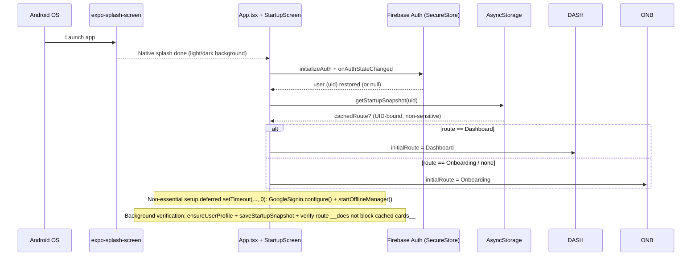
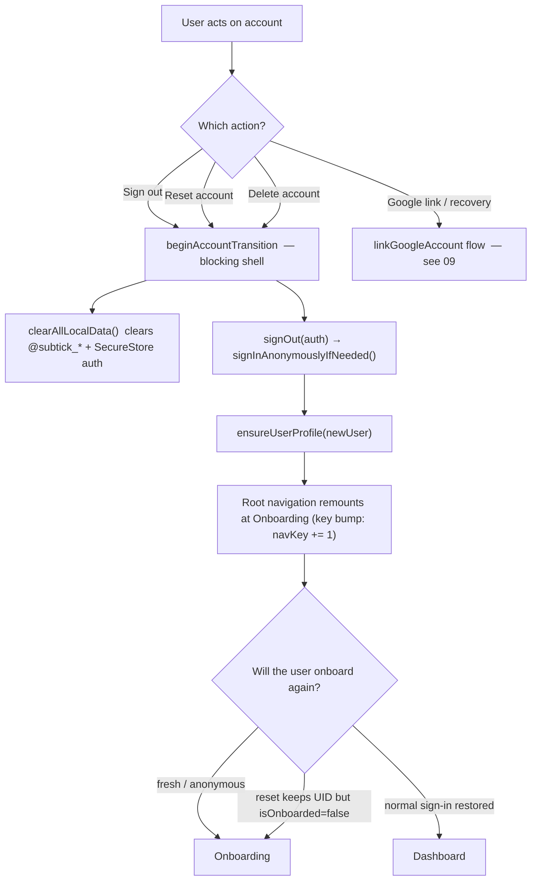
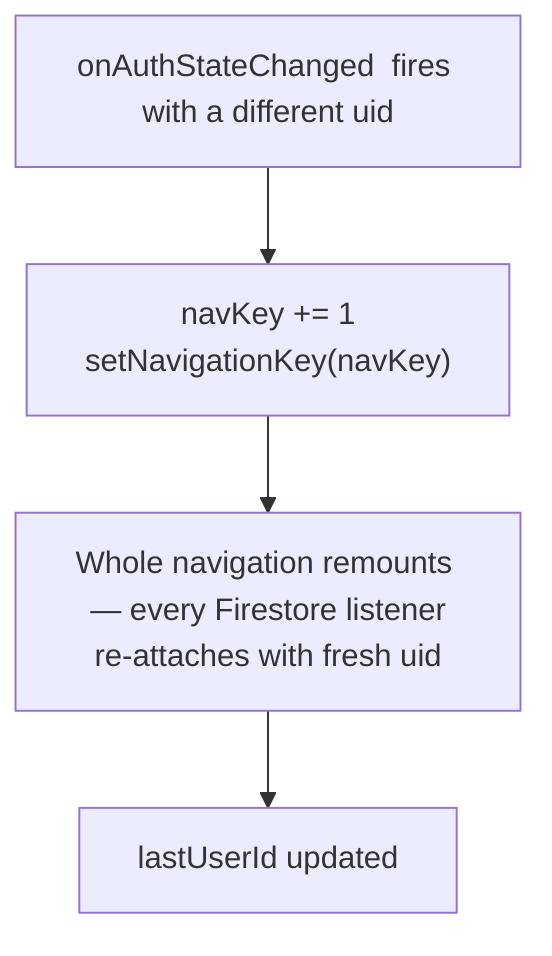

# 01 — Startup & Authentication

> **What this shows:** what actually happens between "user taps the icon" and "the screen
> they land on" — including how the app restores the identity, chooses the route, and
> handles account switches without flashes.

---

## 1. Launch sequence

---

## 2. Account-change remount (flowchart)

---

## 3. Session persistence details

- **Identity storage:** Firebase auth tokens live via `initializeAuth` with
  `getReactNativePersistence(secureStorePersistence)` — an expo-secure-store-backed
  adapter (iOS Keychain / Android Keystore). Firebase's key names contain characters
  (`:`, `[`, `]`) that SecureStore rejects — the adapter sanitises them
  (`key.replace(/[^a-zA-Z0-9._-]/g, '_')`.
- **Route snapshot:** `@subtick_startup_snapshot_{uid}` — non-sensitive, UID-bound,
  last-known onboarding state. It is **display shortcut only**; it never proves
  identity or permission — Firebase must restore the exact UID before it is read.

## 4. UID change mid-session

---

## 5. Key details — nothing left out

- **Order matters:** identity restore happens *first*; the local snapshot is read
  *only after* the UID is known — so cached cards can never leak between accounts. 
- **Verification:** `verifyProfile()` runs in the background when a cached route existed
  (`void verifyProfile().catch(...)`), and only blocks startup when no cached route exists.
- **Emulator hook:** `USE_EMULATORS = __DEV__ && EXPO_PUBLIC_USE_EMULATORS === 'true'`
  — connects Auth/Firestore/Functions emulators only in dev builds with the env var set.

- **Startup timing logs:** `[Startup Timing]` messages are wrapped in `__DEV__` — they
  never appear in production.
- **Startup dismissal condition:** the app dismisses the startup shell only when
  `startupPreparationComplete` **and** `startupTypingComplete` both true — the
  return-visitor card preparation and the typewriter animation both finish before the
  shell gives way (no card-less flash).

## 6. Where this lives

| Concern | File |
|---|---|
| Root init, UID remount, deferred setup | `App.tsx` |
| Anonymous/Google auth, profile bootstrap, sign-out | `src/services/auth.ts` |
| Firebase init + SecureStore persistence + client_id | `src/services/firebase.ts` |
| Account-transition blocking shell | `src/services/accountTransition.ts` |
| Route snapshot + dashboard cache | `src/services/startupCache.ts` |
| Splash config | `app.json` → `expo-splash-screen` plugin |