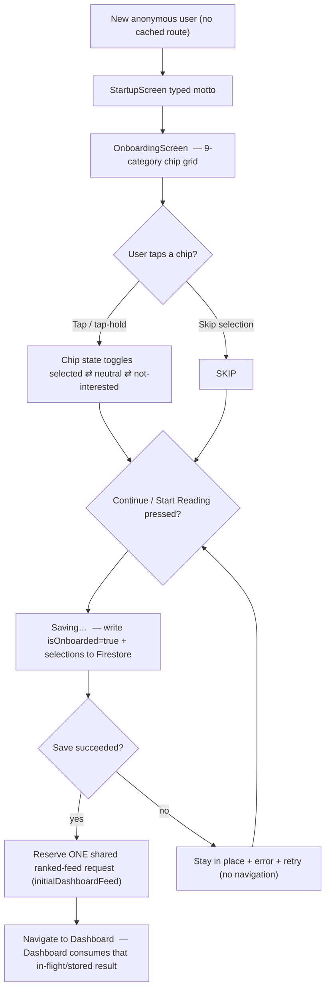
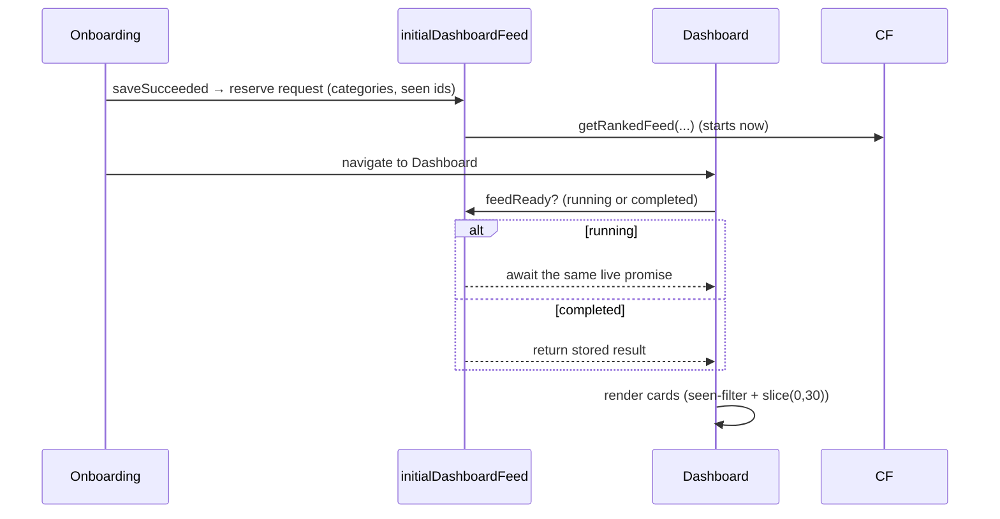
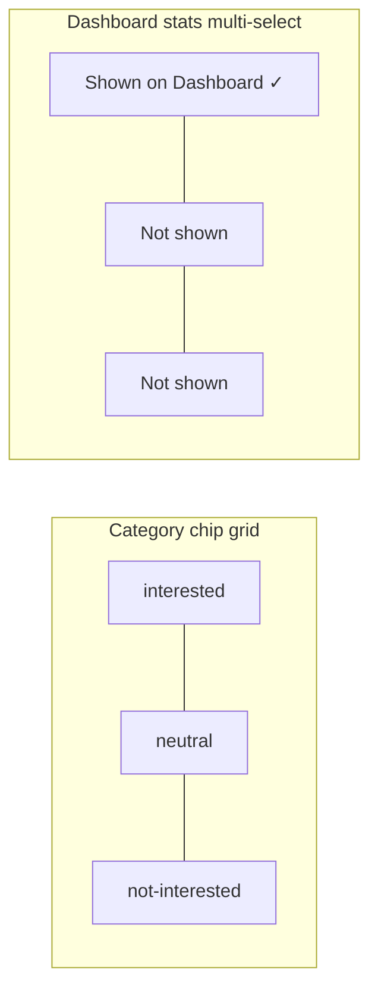

# 02 — Onboarding & Preferences

> **What this shows:** how a brand-new user picks categories without being able to get
> stuck (save happens *before* navigate, so onboarding can't silently reappear), and how
> the other preference screens (categories, archived toggle, dashboard stats) work.

---

## 1. First-launch onboarding flow

---

## 2. The "one shared feed request" handoff (why no duplicates)

---

## 3. Feed-saving guarantees

- **Save-before-navigate:** `handleContinue` awaits the Firestore write (`isOnboarded +
  selected/notInterested ids`) *before* touching navigation. If it fails, the user stays
  on the screen, sees "Saving…" briefly,the tap is blocked (double-tap guard),and a
  retry message appears. This removed the old "onboarding reappears after restart" race.
- **Skip selection is safe:** it intentionally allows a broad first feed until the user
  teaches Tangent what they like (see `docs/audit-backlog.md` M8 — wording only).

---

## 4. Preference screens

| Screen | What it edits | Save behaviour |
|---|---|---|
| Category Preferences | `selectedCategoryIds` / `notInterestedCategoryIds` | Auto-save on tap via `updateCategoryWeights()` + `refreshProfile()` — no confirm |
| Settings → Archived Articles | `includeArchivedArticles` | `TangentToggle` — local value moves instantly, control disables during the write, and restores the prior value on failure |
| Dashboard Stats | `dashboardMetricIds` | Optimistic toggle + `setDoc` merge; **max 3 metrics** enforced |

---

## 5. Key details — nothing left out

- **The category list is a CONTRACT — now enforced:** `src/utils/constants.ts`
  `CATEGORIES` (client) must stay in sync with the server's canonical copy in
  `firebase/functions/src/categories.ts` (`DASHBOARD_CATEGORIES_ARRAY`). The
  `npm run test:category-contract` regression test (part of `typecheck`) fails loudly if
  they drift, and the server logs an error on any unknown category. Update BOTH together
  when categories change.
- **Dashboard metric rules:** picker prevents a 4th selection and removes duplicate
  old selections. The Weekly Reads value on the pill is computed from actual
  qualifying events in the rolling 7 days (`≥40%` depth reads), not a stored counter.
- **Auto-save failure in category prefs:** state rolls back inline (same pattern as
  the archived toggle).

---

## 6. Where this lives

| Concern | File |
|---|---|
| Onboarding screen | `src/screens/OnboardingScreen.tsx` |
| Category chip grid (3-state) | `src/components/CategoryChipGrid.tsx` |
| First-feed handoff | `src/services/initialDashboardFeed.ts` |
| Archived toggle | `src/components/TangentToggle.tsx`, `src/screens/SettingsScreen.tsx` |
| Stats picker | `src/screens/DashboardStatsScreen.tsx` |
| Categories constant | `src/utils/constants.ts` |