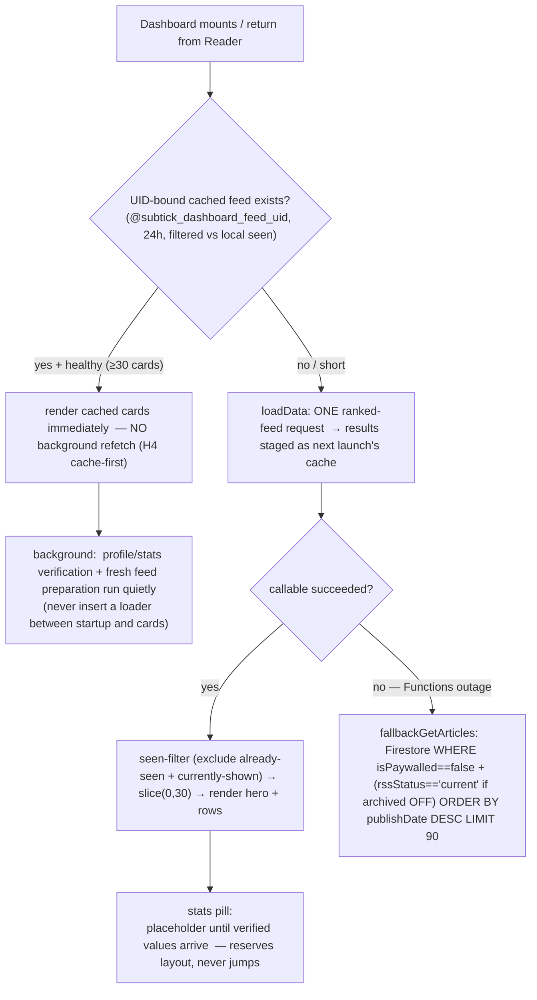
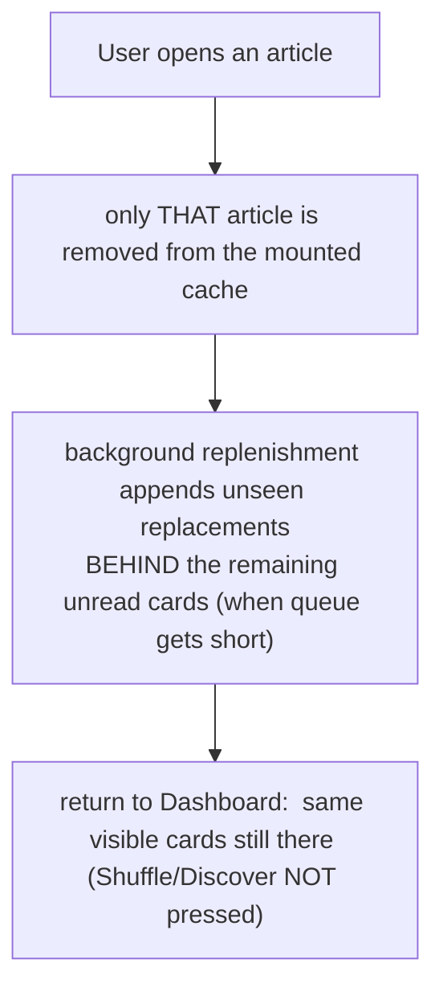

# 03 — Dashboard Feed (what the phone asks for, shows, caches)

> **What this shows:** the Dashboard screen's whole lifecycle — from cached first cards
> to a fresh ranked request, to what changes the cards (and what deliberately does not). The
> server side of "what gets returned" is the big pipeline in `04-article-journey.md`; here it is
> all from the phone's point of view.

---

## 1. What happens on mount/return

---

## 2. While Reader is open (what happens to the mounted Dashboard

- **No re-request on focus:** focus-time only flushes the behavior queue — cards are
  not refetched unless depleted (A5 focus-refetch guard).
- **Reader queue shuffle happens on tap** — untapped cards stay randomized; ranked-order
  preservation is deferred (see audit-backlog.md A5).

---

## 3. What changes the visible feed (and what doesn't)

| Action | Result |
|---|---|
| Return from Reader (no shuffle) | Cards unchanged (opened article removed; unseen replacement appended when short) |
| **Shuffle** button | new feed request excluding seen + currently-shown |
| **Discover** button | new feed request (same exclusion) |
| **Pull-to-refresh** | real fetch excluding seen + on-screen (no fabricated hold, no secret shuffle) |
| Retry (after error) | new request |
| New account / sign-out / reset / delete | cache cleared; fresh feed |
| Profile verification finishing | quiet background update — visible cards untouched |

---

## 4. Key details — nothing left out

- **Cache contents:** non-sensitive, UID-bound latest unread cards + shown IDs;
  expires 24h; filtered against local seen IDs before display; cleared on sign-out/reset/
  delete/UID-change; never another account's cards. 
- **Fresh results are staged, not swapped:** the background fresh feed's result is saved
  as *next launch's* cache — it does not replace the cards you're looking at (H4).
- **Hero card:** position 0 is the highest-scoring eligible article (locked server-side;
  see 04/05). 
- **Stats pill:** placeholder reserves the vertical space from the first frame — verified
  values arrive later with zero layout jump. Weekly Reads uses the same 40%-depth
  qualifying-event rule as the server.

---

## 5. Where this lives

| Concern | File |
|---|---|
| Dashboard screen + loadData | `src/screens/DashboardScreen.tsx` |
| Cache-first startup + UID-bound snapshot | `src/services/startupCache.ts` + `src/services/dashboardFeedCache.ts` |
| Shared first-feed handoff (onboarding→Dashboard) | `src/services/initialDashboardFeed.ts` |
| Functions-outage fallback | `src/services/feedService.ts` (`fallbackGetArticles`) |