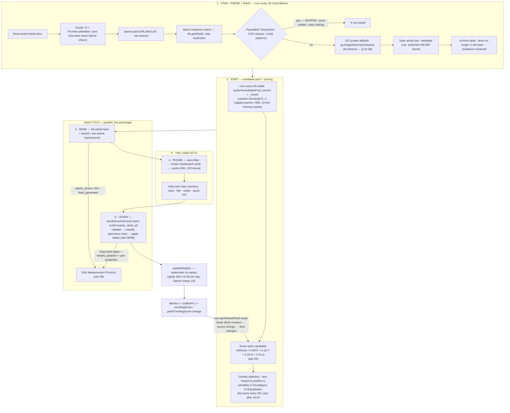

# 04 — An Article's Full Journey (through the backend) + the User-Influence Loop

> **What this shows:** one article's entire trip — from RSS discovery to a card on a
> phone, plus everything the user's actions then change that feeds back into scoring.
>
> This is the big-picture file. For the inner maths, see `05-ranking-algorithm.md`
> (components + formula) and `06-weight-learning.md` (deltas + drift).

---

## 1. The one big lifecycle



---

## 2. The user-influence loop (who changes the weights, exactly)

```mermaid
sequenceDiagram
    participant U as User
    participant R as ReaderScreen (behaviour tracker)
    participant Q as Behavior queue (AsyncStorage, 500 cap, mutex)
    participant CF as syncBehaviorEvents (onCall)
    participant FS as Firestore
    participant GA as GA4
    U->>R: read / save / like / swipe / quick-exit
    R->>Q: queue raw read_session + explicit events
    Q->>CF: batch flush (≤100 events, client_id)
    CF->>CF: validate + classify  geometry-only:  thorough ≥70% / shallow ≥40% / quick-exit <20% & <15s
    CF->>FS: persist final event type (+ feedId / impressionId)
    CF->>CF: deltas:  category latent δ ×A (read-sessions; explicit ×1.0)
    CF->>FS: update user weights + publisher quality + trending (one batch; watermark moves)
    CF->>GA: final types + weight_updated + user properties
    Note over U: Next getRankedFeed reads the new latents → different scores → different feed — the loop closes. Nothing here rewrites the saved article doc itself; only the user's numbers change.
```

---

## 3. What each user action actually changes

| Your action | category latent δ | publisher latent γ | trendingScore | scaled by A ? |
|---|---|---|---:|---:|---:|
| **Like** | +0.40 | +0.005 | +2.0 | no (explicit) |
| **Unlike** | −0.40 | — | −2.0 | no (explicit) |
| **Save** | +0.55 | +0.010 | +3.0 | no (explicit) |
| **Unsave** | −0.55 | — | −3.0 | no (explicit) |
| **Read thorough** (≥70% depth) | +0.275 | +0.005 | +1.5 | **yes** — ×A |
| **Read shallow** (40–70%) | +0.10 | — | +0.2 | **yes** — ×A |
| **Read skim** (legacy record) | +0.10 | — | +0.5 | **yes** — ×A |
| **Quick exit** (<20% & <15s) | −0.6875 *(thresholded — see 06)* | −0.010 | — | **no** (counted per axis; capped penalty only after 2 exits in 24h) |
| **Swipe past / exit** | 0 | — | 0.0 | — |
| **Not interested** (right-swipe) | −0.6875 | −0.010 | — | no (explicit) |

**Engagement Index A** — how much a read-session delta is scaled down when someone reads
*fast*: pace = session WPM ÷ personal averageWpm:

| Relative speed | A (pace penalty) |
|---|---:|
| ≤1.25× personal average | 1.00 (full credit) |
| =2.0× personal average | 0.50 |
| ≥3.0× personal average | 0.00 (a fling counts as nothing for weights) |

Explicit tap-actions (like/save/unsave/not-interested) always ship unscaled (×1.0).

---

## 4. The article record itself - what survives, what does not

- **Stored on the article doc:** title, author, publicationName, publicationUrl, feedUrl,
  category, lengthStyle, guid, description (300 chars), publishDate, wordCount,
  estimatedReadMinutes, qualityScore (from feed config), rssStatus (current->archived),
  isFresh, random_score, trendingScore + peakTrendingScore, frontendRules,
  isPaywalled (false - paywalled items are never written at all).

- **Deliberately NOT stored server-side:** `bodyHtml` — no article body ever lives
  on Firebase. At read time the phone fetches the live RSS itself (see `07-reader.md`).

- **Trending decay:** daily ×0.9057 (only for scores > 1.0; peakTrendingScore never
  decays - it is the all-time high used by the cleanup cron.

- **Old-article cleanup:** every 72h - query the  500 worst-scoring articles >3 months
  old (peakTrendingScore ASC) - delete bottom 3% of sample (fixed
  500-read ceiling. Paywalled purge step finds nothing since ingestion skips them.

- **random_score + isFresh:** assigned at ingestion; random_score refreshed daily by the
  decay cron so the pool sampler stays random cheaply; isFresh stickers expire for
  low-engagement articles via a bounded daily pass (composite index `isFresh` + `publishDate`).

---

## 5. Where this lives

| Step | File |
|---|---|
| Ingestion (find/parse/save/archive) | `firebase/functions/src/rssCollector.ts` |
| Candidate pool cron + scoring + selection | `firebase/functions/src/getRankedFeed.ts` |
| Feed response + analytics staging | `firebase/functions/src/getRankedFeed.ts` |
| Client sensing + queue | `src/hooks/useBehaviorTracker.ts` → `src/services/behaviorSync.ts` |
| Server classify + deltas | `firebase/functions/src/syncBehaviorEvents.ts` |
| Weight watermark/drift/clamp | `firebase/functions/src/weightUpdater.ts` + `constants.ts` |
