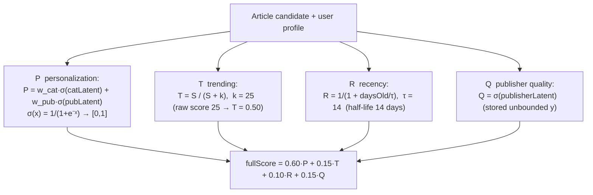
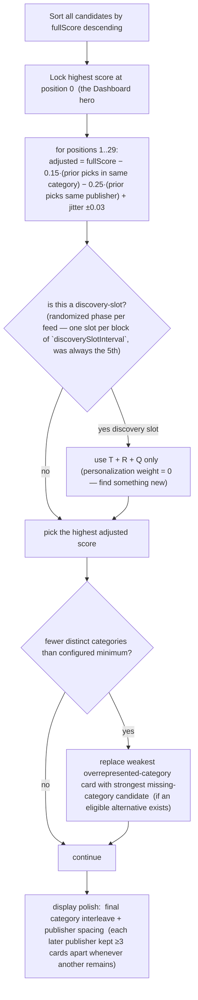

# 05 — The Ranking / Scoring Algorithm (the maths, visualised)

> **What this shows:** exactly how one article gets a number, and how those numbers
> become a 30-card feed. Everything below is pulled from `getRankedFeed.ts` and
> `firebase/functions/src/constants.ts` — no estimates.

---

## 1. The four components P / T / R / Q — one formula

**The rule that makes the weights honest:** every component outputs `[0, 1]`,
so the formula weights mean exactly what they say. Diversity is not a 5th
component — it's enforced during selection (below). One formula is used for **both**
selection **and** ordering. No separate "tail" formula exists in v2.

## 2. Sigmoid cheat-sheet (σ(x) = 1/(1+e⁻ˣ)

| Latent x | σ(x)  (≈ score) | Plain meaning |
|---|---:|---|
| −2.2 | 0.10 | strongly disliked |
| −0.69 | 0.33 | mildly disliked |
| 0.0 | 0.50 | neutral |
| 0.69 | 0.67 | likes |
| 1.386 | 0.80 | **new publisher default seed** |
| 2.2 | 0.90 | excellent |

> **Sigmoid saturation is intentional (accepted design):** σ flattens above ~2.2, so
> beyond ~18–20 thorough reads (or ~10 likes) in a category, extra positive signals
> barely move `P`. This is a deliberate "preference is bounded" choice for v2 — not a
> clamp bug — and the ±20 `latent.clamp` never realistically binds. If we ever want to
> differentiate among superfans, the lever is a softer curve / wider scale, not the clamp.

---

## 3. Cold-start balance for P

| Does the user have any stored history for this publisher? | category share | publisher share |
|---|---:|---:|
| **Yes** (even a negative weight) | 0.60 | 0.40 |
| **No** (cold start) | 0.90 | 0.10  (configurable; unknown latent defaults to 0 → σ = 0.50) |

---

## 4. Greedy selection — how 30 cards are picked

**Also enforced (safety nets, not scoring components):**
- `maxArticlesPerCategory` hard cap — worst case category dominance cannot happen.
- The hero lock is **protected** from later category-variety replacement.
- Selection applies no separate tail formula — one greedy pass, one formula.

## 5. Feed assembly — the important ordering decisions

- **Hero vs rest:** position 0 is reserved for the single highest-scoring eligible
  article (gives the opening screen a strong first impression). Positions 1–29 keep
  the tranche-balanced, category-varied order from the greedy pass.

- **Reader preserves this order:** the backend order is kept by the Reader queue — a
  tapped card opens at its own position; no second client-side shuffle. A readiness
  reorder may move a *prepared* card earlier within the next five unseen positions on
  Android, but the recommendation membership/impression_id never change (see 07).
- **Seen + highlight filtering:** candidates already seen or currently on screen are
  excluded before selection; final response limited to 30. 

## 6. Where this lives

| Concern | File |
|---|---|
| `normalizeP/T/R/Q` + `selectFeed` | `firebase/functions/src/getRankedFeed.ts` |
| Score weights + constants | `firebase/functions/src/constants.ts` (`SCORE_WEIGHTS` etc.) |
| Trending decay (×0.9057 daily) | `firebase/functions/src/getRankedFeed.ts` (`cronDecayTrendingScores`) |
| Random sampling basis | `random_score` on every article (ingestion + daily refresh) |