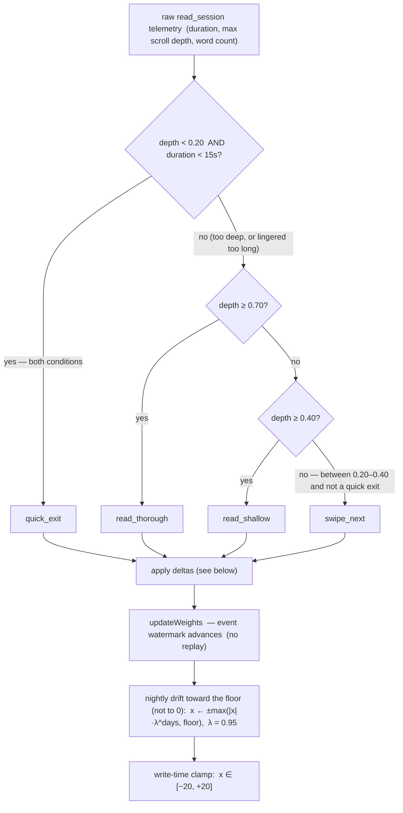
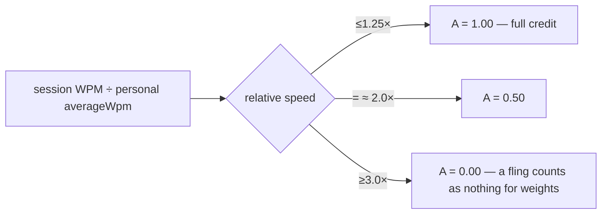
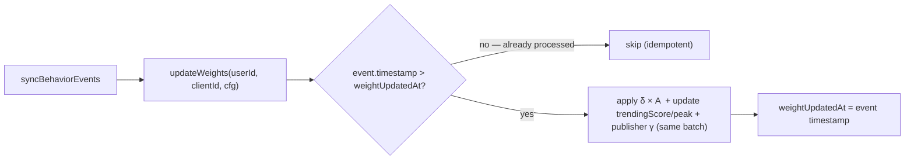
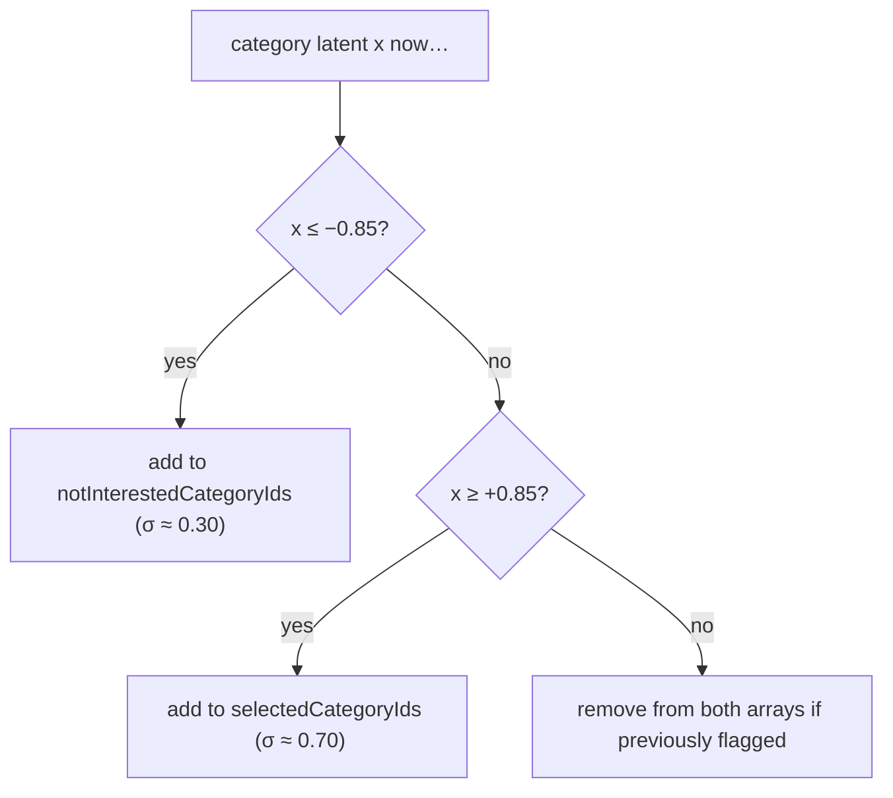

# 06 — Weight Learning (event → delta → drift)

> **What this shows:** how a single action becomes a number that changes the next feed.
> The pipeline: raw telemetry → server classifies → delta applied (× Engagement Index
> for reads)→ watermarked → nightly drift pulls toward neutral. All values are exact.

---

## 1. Classification first — what did the user actually do?

`classifyRead` is a **decision tree that stops at the first match** — it is NOT three
independent checks, so nothing can double-fire. Order matters: thorough is checked
before shallow, otherwise a deep read would incorrectly match the shallow gate.

**Quick-exit is a thresholded rejection, not a per-tap penalty.** A single quick exit
can't distinguish "opened the wrong card and backed out" from "genuinely hated this."
So quick exits are **counted per preference axis** (category / length / publisher) in a
rolling `rejection.windowMs` (24h) and one capped penalty applies only once an axis's
configured minimum (`rejection.*MinQuickExits`, default 2) is reached. A positive signal
on that axis clears the evidence. See `06` §"Threshold-based rejection".

---

## 2. The Engagement Index A — how much a read "counts"

- Reads within the plausibility band count: personal `averageWpm` recalibrates on any
  visit, but only from **consumed words** (word count × scroll depth) within
  `[80, 600]` WPM and above a 150-word floor. Skims/flings can't corrupt the
  baseline (`weightUpdater.ts`).
- **Explicit actions are never scaled:** like, save, unsave, not-interested always ship
  ×1.0. Only read-session outcomes (thorough/shallow/skim/quick_exit) multiply
  by A. `swipe_next` has δ = 0.00 anyway.

---

## 3. The deltas — exact numbers

| Event | category latent δ | publisher latent γ | trendingScore |
|---|---:|---:|---:|
| save | +0.55 | +0.010 | +3.0 |
| unsave | −0.55 | — | −3.0 |
| like | +0.40 | +0.005 | +2.0 |
| unlike | −0.40 | — | −2.0 |
| read_thorough | +0.275 | +0.005 | +1.5 |
| read_shallow | +0.10 | — | +0.2 |
| read_skim (legacy) | +0.10 | — | +0.5 |
| quick_exit | −0.6875 *(thresholded — see below)* | −0.010 | — |
| swipe_not_interested | −0.6875 | −0.010 | — |
| swipe_next | 0 | — | 0.0 |

- **Thresholded rejection (v2):** a quick exit **no longer applies per-tap**. Quick exits
  are counted per axis — category, length-style, and publisher — inside a rolling
  `rejection.windowMs` (24h). One capped penalty (`rejection.maxCategoryPenalty`, default
  −0.6875) applies only when an axis's minimum is reached (`rejection.*MinQuickExits`,
  default 2). A positive signal on an axis clears its evidence. So a single mis-tap does
  nothing; a genuinely disliked category still gets suppressed once several quick exits
  confirm it. All of these are config-driven, ready for the future Control Dashboard.
- **Asymmetric rejection:** the thresholded penalty is still −2.5 × read_thorough in
  magnitude; it is just gated behind repeated evidence instead of one immediate step.
- **Read-session rows** (thorough/shallow/skim) are scaled by the Engagement Index A.
- **Publisher latents** are seeded at `y = 1.386` (→ Q = 0.80) for new publishers;
  write-time clamp ±20.

---

## 4. Watermarks — why actions don't replay

| Timestamp | What it advances |
|---|---|
| `weightUpdatedAt` | Event watermark: last event timestamp processed by `updateWeights()` — only new events are processed each sync |
| `weightsDecayedAt` | Last nightly-drift application — drift applies once per full elapsed day (`λ^elapsedDays`, λ=0.95) and decays each latent's magnitude toward the `latent.driftFloor` (0.5), never past it |

---

## 5. UI sync thresholds (what the user sees change)

These arrays ride back into the next feed request (personalization share + discovery
flags), and Category Preferences screen.

---

## 6. Where this lives

| Concern | File |
|---|---|
| Classification + deltas + trending | `firebase/functions/src/syncBehaviorEvents.ts` |
| Weight/drift watermark + clamp | `firebase/functions/src/weightUpdater.ts` |
| δ values + engagement thresholds | `firebase/functions/src/constants.ts` |
| Raw sensing + session snapshot | `src/hooks/useBehaviorTracker.ts` |