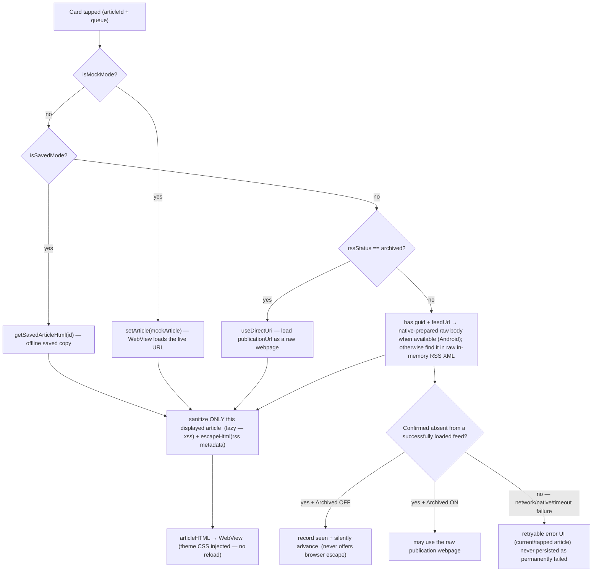
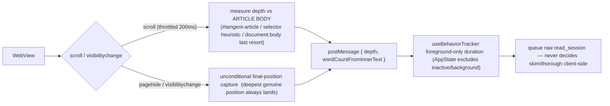
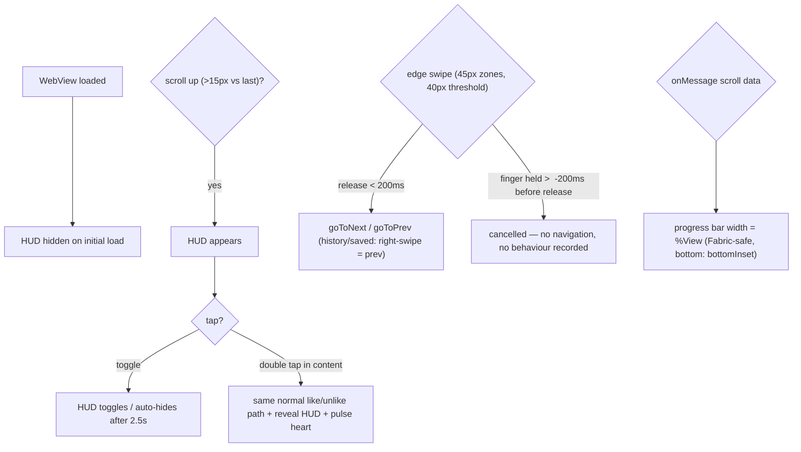
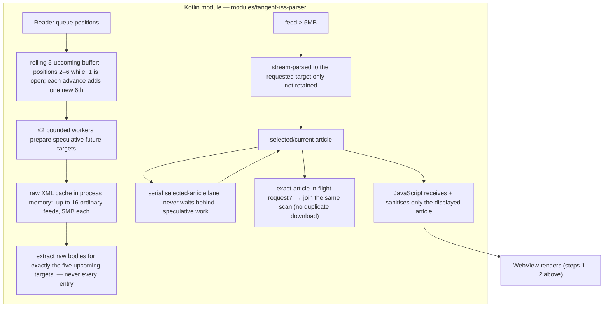
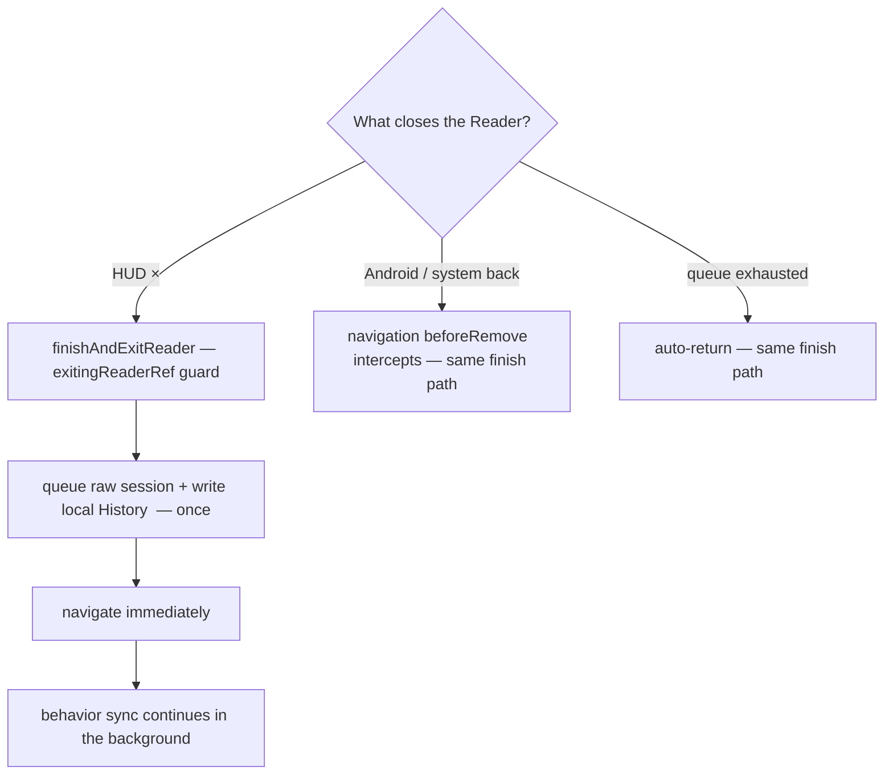

# 07 — The Reader (article open, WebView, gestures, HUD, exit paths)

> **What this shows:** exactly what happens from the moment a card is tapped until the
> Reader closes — including the Android native preloader that does the heavy lifting off=
> the JavaScript thread. Details: `src/screens/ReaderScreen.tsx` + the five feature files#
> under `src/features/reader/`.

---

## 1. Opening an article

---

## 2. Inside the WebView (behaviour sensing

---

## 3. The HUD, gestures, and progress bar

- **WebView navigation lock:** sanitized mode — any `http` link → OS browser (`Linking.openURL`, return false). Raw/archived mode — same-domain allowed; cross-domain → OS browser. HTTP ≥400 or load error in an allowed raw page → error UI + "Open in Browser" (archived-ON only..
- **Opaque surfaces:** a new article request immediately unmounts the previous WebView behind an opaque theme surface; spinner only after 180ms — no publisher-page flash beneath a loader/error.

---

## 4. Android native RSS preloader (the performance engine

- **Cache lifetime:** process memory only — never written to disk; discarded when
  Android closes the app.
- **Stale work:** a genuine swipe lets only already-running native work finish, then
  replaces stale queued targets with the latest buffer; a harmless readiness reorder
  never restarts the same five targets.

- **iOS / old dev builds:** no native module yet — JavaScript `fast-xml-parser` fallback
  remains the safe path (see `docs/tech-context.md` iOS parity work).

---

## 5. Exit — the three guarded paths (one finish route

- Saved / history / mock-browsing exits are **excluded** — no session is recorded there..
- **Right-swipe in history/saved** correctly calls `goToPrev()` (no false next).

---

## 6. Where this lives

| Concern | File |
|---|---|
| Orchestrator (PanResponder, WebView, HUD wiring) | `src/screens/ReaderScreen.tsx` |
| Article loading + RSS matching | `src/features/reader/useArticleLoader.ts` |
| Queue + preloader trigger | `src/features/reader/useNavigationQueue.ts` |
| HUD state | `src/features/reader/useReaderHUD.ts` |
| Red `Loading|` cursor | `src/components/LoadingCursor.tsx` |
| Android Kotlin parser | `modules/tangent-rss-parser/` |
| Session sensing | `src/hooks/useBehaviorTracker.ts` |