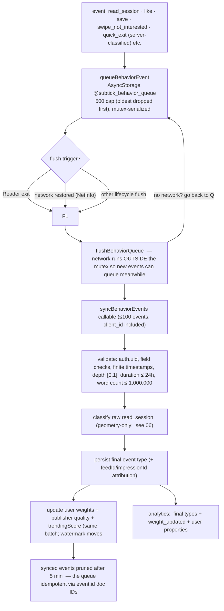
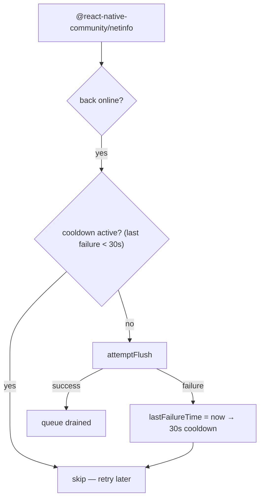

# 08 — Behavior Sync & the Offline Queue

> **What this shows:** what happens to every event between "user does a thing" and
> "the server learns from it" — including what survives being offline.

---

## 1. Queue → flush → learn

---

## 2. The offline manager (network watch)

- **Concurrent callers share ONE upload:** module-level in-progress promise — two
  flushes can't send the same unsynced 20-event batch twice (B6 fix..
- **Reader-safe sync:** reaching the 20-event batch size never starts an upload during
  active reading — events stay queued until Reader exit / reconnect / lifecycle flush.

## 3. Failure table — nothing left out

| Scenario | Behaviour |
|---|---|
| Sync fails | 30s cooldown, then retry |
| Queue overflow | 500 cap; oldest dropped |
| Server input cap | ≤100 events per call; malformed telemetry rejected before persist |
| Concurrent flush | Share one in-progress upload promise |
| Offline session | Raw session queued honestly until reconnect; profile stats stay provisional |
| Synced events cleanup | Pruned after 5 min if `synced: true` |
| Duplicate send | `event.id` is the Firestore doc ID — idempotent |

---

## 4. Where this lives

| Concern | File |
|---|---|
| Client queue + flush | `src/services/behaviorSync.ts` |
| Mutex factory | `src/services/asyncStorageMutex.ts` |
| Offline reconnect manager | `src/services/offlineManager.ts` |
| Session sensing (what goes in the queue)) | `src/hooks/useBehaviorTracker.ts` |
| Server validate + classify + deltas | `firebase/functions/src/syncBehaviorEvents.ts` |