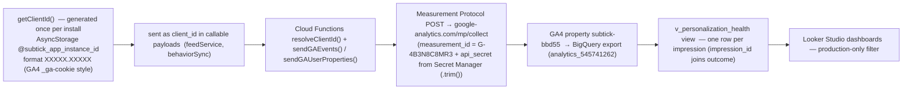

# 09 — Analytics (client_id → GA4 → BigQuery → Looker)

> **What this shows:** how the app measures itself — every event, every where it goes,
> and how the reporting pipeline turns raw activity into the personalization-health charts.

---

## 1. The pipeline

---

## 2. The events sent

| Event | When | Extra fields |
|---|---|---|
| `feed_generated` | once per feed request | tranche counts, distinct publishers/categories |
| `article_shown` | per article in the returned feed | feed/impression ID, position, tranche, dominant component, P/T/R/Q, final_score, user stage, discovery flags |
| `read_thorough` / `quick_exit` | server-classified read outcomes | impression attribution, session fields |
| `swipe_not_interested` | right-swipe rejection | impression attribution |
| `save` (and unsave) | deliberate action | impression attribution |
| `weight_updated` | per latent change | entity type/id, old→new value, trigger |
| `config_changed` | every scoring-config write | — |

**User properties** (sent after weight updates): `concentration_score`, `top_cat_weight`, `cats_at_ceiling`.

**On every event:** `session_id = Math.floor(Date.now()/1000)` (Realtime-compatible), details as `analytics_environment` = `production` or `emulator` (server-derived, so test traffic is filterable), and `client_id`.

---

## 3. Chunking & debug

- Auto-chunked at **25 events per request**.
- `GA_DEBUG` toggle in `firebase/functions/.env` sends to `/debug/mp/collect` and
  logs `validationMessages` — used to verify payloads before production deploy. Payloads confirmed `validated OK (no issues)`.
- **No raw internal account IDs in GA4** — the stable `client_id` is the per-install
  identity (not the Firebase UID).

## 4. The reporting contract (what the charts answer)

- The canonical source is `docs/analytics-looker-guide.md` — dashboard setup + metric formulas.
- **production-only reporting:** filter `analytics_environment = 'production'` — emulator rows
  stay for pipeline testing only.
- **Attribution:** a later read/like/save carries the same `impression_id` as its
  original card position — so one impression can be joined to its outcome exactly.

## 5. Where this lives

| Concern | File |
|---|---|
| Client id + payloads | `src/services/firebase.ts`, `src/services/feedService.ts`, `src/services/behaviorSync.ts` |
| Server GA helpers | `firebase/functions/src/analytics.ts` |
| Event producers | `firebase/functions/src/getRankedFeed.ts` (feed/impression), `syncBehaviorEvents.ts` (behaviour/weights), `weightUpdater.ts` (weight_updated), `updateScoringConfig` (config_changed) |
| SQL view | `firebase/analytics/create_personalization_health_view.sql` |