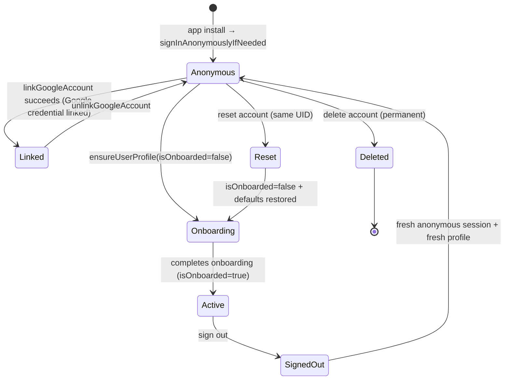
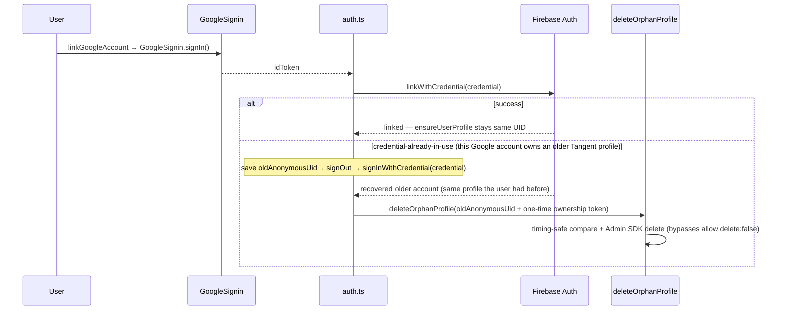
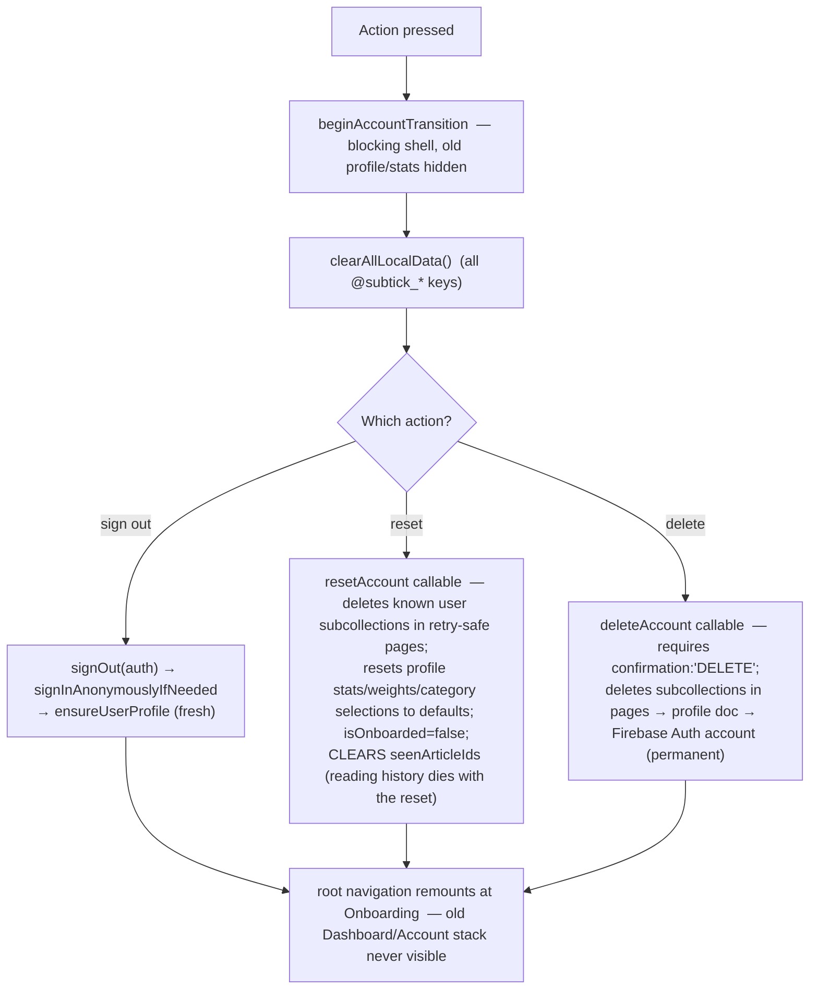

# 10 — Account Management (identities, link, reset, delete)

> **What this shows:** the different identities a user can be (anonymous vs Google-linked),
> and exactly what sign-out / reset / delete do — including the transitions shell that
> blocks stale screens and the orphan-profile recovery flow.

---

## 1. Identity state machine

---

## 2. Google link + orphan recovery

---

## 3. The transition shell (sign out / reset / delete)

---

## 4. Key details — nothing left out

- **Reset vs delete:** reset keeps the same UID but forces re-onboarding; delete
  removes everything permanently (both server subcollections + Auth account + local data).
- **Reset really is a fresh start:** the server reset also sets `seenArticleIds: []`
  (the cross-device reading history), wipes the threshold-rejection evidence
  (`rejectionEvidence`), and deletes the `behavior_events` + `saved_articles`
  subcollections, and the phone clears its local `@subtick_*` storage.
  So a reset user's old history can no longer silently re-filter their new feed.
- **Orphan-cleanup edge case (accepted):** the one-time ownership token is stamped by
  the same device that holds the anonymous session, so cross-device recovery of that
  specific orphan can't even arise. If the token's `setDoc` fails at the exact moment of
  sign-in (e.g. a network blip), cleanup is **skipped by safe default** and the stale
  anonymous Firestore profile lingers. Firebase auto-expires the anonymous *auth* record
  after 30 days; the leftover Firestore doc would need a future server sweep (documented,
  known, low-impact).
- **isActive soft-disable:** admins can set `isActive=false` in the Firestore console —
  the profile stays but feed/behavior callables reject it. (Not exposed in the app.)
- **Seen/saved data:** sign-out/reset/delete all clear local AsyncStorage; cross-device
  seen IDs live on the profile and go with whatever happens server-side.

## 5. Where this lives

| Concern | File |
|---|---|
| Link/unlink/sign-out/reset/delete | `src/services/auth.ts` |
| Transition shell | `src/services/accountTransition.ts` |
| Reset/delete/deleteOrphanProfile callables | `firebase/functions/src/index.ts` |
| Account screen | `src/screens/AccountScreen.tsx` |