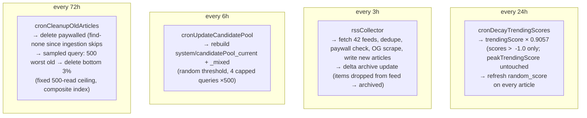

# 11 — Cloud Functions & the Cron Schedule

> **What this shows:** every server-side function — its trigger, its auth/secret
> requirement, and what it does. All 14 exports live in `firebase/functions/src/index.ts`.

---

## 1. The cron schedule (what runs on its own

---

## 2. All 14 exports

| Function | Type/Trigger | Auth / secret needed | What it does |
|---|---|---|---|
| `rssCollector` | schedule 3h | — | Ingest feeds → articles |
| `cronUpdateCandidatePool` | schedule 6h | — | Rebuild shortlists |
| `cronDecayTrendingScores` | schedule 24h | — | Decay trending, refresh random_score |
| `cronCleanupOldArticles` | schedule 72h | — | Paywalled purge + old cleanup |
| `getRankedFeed` | onCall | firebase auth (uid) | 30-article ranked feed + impression/feed analytics; `configOverride`/`includeScores` honoured only with CONTROL secret |
| `syncBehaviorEvents` | onCall | firebase auth (uid) | Validate + classify + store events; update weights/trending/publisher quality; analytics |
| `updateScoringConfig` | onCall | CONTROL_DASHBOARD_SECRET | Write clamped live scoring config; `config_changed` analytics |
| `addRssFeed` | onCall | CONTROL_DASHBOARD_SECRET | Validate HTTPS RSS/Atom, write active feed record, run immediate collection |
| `setPreviewConfig` | onCall | CONTROL_DASHBOARD_SECRET | Write Matrix preview config (non-live) |
| `getPreviewConfig` | onCall | firebase auth | Return current Matrix preview |
| `getScoringConfig` | onCall | firebase auth | Return effective/stored/default config |
| `resetAccount` | onCall | firebase auth | Reset profile + subcollections to defaults, re-onboard |
| `deleteAccount` | onCall | firebase auth + `confirmation:'DELETE'` | Permanent delete: pages → profile → Auth account |
| `deleteOrphanProfile` | onCall | firebase auth + one-time ownership token (timing-safe) | Admin-SDK delete of stale anonymous profile after Google recovery |

---

## 3. Key details

- **All scheduled jobs share one codebase** — each is exported alongside the callables
  from the same `index.ts`; the functions emulator can run them on demand too..
- **Cost caps everywhere:** pool queries ×500 cap; cleanup 500-read ceiling; feeds
  chunked ×5; analytics chunked ×25; seen arrays pruned; queue capped 500; batch
  capped 100 events. 
- **Cleanup preserves once-popular articles by design.** `cronCleanupOldArticles`
  ranks by `peakTrendingScore` (the all-time high, which never decays) on purpose:
  a previously-viral article is treated as high-quality and kept in the database,
  even if nobody has read it recently. Current `trendingScore` (which *does* decay
  daily) decides what appears in feeds instead. This is deliberate — do not "fix"
  it to rank cleanup by current engagement without revisiting the intent.
- **Discovery-slot phase is randomized per feed** (see `05`): the same *count* of
  discovery cards fires every feed, but *which position* varies, so users can't
  learn "the 5th card is always discovery" and skip it on autopilot.
- **Control Dashboard now reflects the full v2 config.** The dashboard (`scripts/control_dashboard.html`) renders every live group from the server defaults: `scoring`, `feedback`, `latent` (including the new `driftFloor`), `rejection` (quick-exit thresholding), `engagement`, `selection`, `trending`, `quality`, and `classification`. `rejection.windowMs` is shown in **days** and stored in raw ms. The old `learning`/`tranche` sections are no longer rendered (those keys aren't in the v2 config) but their metadata is kept inert in the file.
- **Config caching:** ranking config + candidate pool + publisher qualities cached
  in memory (~60s / 10min / 10min per warm instance).

---

## 4. Where this lives

`firebase/functions/src/index.ts` (exports + cron bodies + callables),
`firebase/functions/src/getRankedFeed.ts`, `syncBehaviorEvents.ts`, `rssCollector.ts`,
`weightUpdater.ts`, `analytics.ts`, `constants.ts`, `dashboardAuth.ts` (shared secret check).