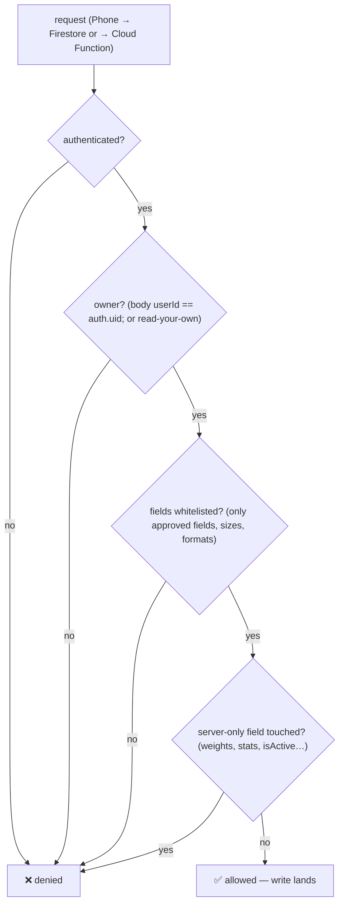

# 12 — Data & Security (what's stored, who can touch it)

> **What this shows:** every piece of on-device and server-side data — its key, its
> size limits, who can read/write it, and how a request passes the security rules.

---

## 1. On-device (AsyncStorage — primary store)

| Key | Content | Max size |
|---|---|---|
| `@subtick_seen_articles` | seen article IDs (also synced to Firestore `seenArticleIds`) | 1000 entries (oldest dropped) |
| `@subtick_seen_articles_meta` | seen metadata records | unbounded |
| `@subtick_saved_articles` + `_meta` | saved IDs + metadata | unbounded |
| `@subtick_saved_html_{id}` | full sanitized HTML for offline read | one key per saved article |
| `@subtick_behavior_queue` | pending behavior events | 500 (oldest dropped) |
| `@subtick_theme_preference` | 'system'/'light'/'dark' | tiny |
| `@subtick_app_instance_id` | GA4 client_id (dotted format) | ~21 chars |
| `@subtick_rss_failed_{id}` | permanent RSS-failure marker | one key per failed article |
| `@subtick_startup_snapshot_{uid}` | non-sensitive UID-bound route/cards | non-sensitive, 24h |
| `@subtick_dashboard_feed_{uid}` | unread card cache | non-sensitive, 24h |

**Concurrency:** all read-modify-write ops go through a Promise-chain mutex
(`src/services/asyncStorageMutex.ts`) — feeds and behavior events use separate queues
(one slow domain never blocks the other).

---

## 2. Server-side (Firestore — collections

| Collection | Who reads | Who writes | Notes |
|---|---|---|---|
| `users/{uid}` | owner | owner prefs (whitelist); weights/stats server-only | delete disabled; `isActive` soft-disable is admin-only |
| `users/{uid}/behavior_events` | owner | direct create (whitelist + 2KB cap); normal path = authenticated callable | update/delete disabled; event.id doc ID idempotent |
| `articles/{id}` | any authenticated | Admin SDK only | bodyHtml NOT stored |
| `feeds/{id}` | — (server) | Admin SDK + protected addRssFeed | default deny for client |
| `publishers/{name}` | server | Admin SDK | latent y (seeded 1.386) |
| `system/candidatePool_*` | server | Admin SDK cron | ~1MB at ~1250 articles (future: strip fields) |
| `feed_requests/{id}` | owner | create (validated: URL, schema, 2KB cap) | no update/delete |
| `feedback/{id}` | never (admin only) | create (validated: schema, 5KB cap) | |

---

## 3. How a request passes (security flow)

**Plus the server-side paths** — for callables, the request.auth.uid is enforced *server-side*
and the client-supplied userId is ignored; raw telemetry is re-validated before Admin-SDK
persistence (nothing trusts the phone).

---

## 4. Notable safety choices

- **`allow delete: if false`** on `users` — profiles can't be deleted via rules, only via
  the Admin-SDK callables (reset/delete/deleteOrphanProfile).
- **Client-writable user fields are whitelisted** (`themePreference`, `dashboardMetricIds`,
  `isOnboarded`, `selectedCategoryIds`, `notInterestedCategoryIds`, `includeArchivedArticles`,
  `lastUpdated` + `seenArticleIds` via `arrayUnion`); everything else is server-only.
- **IsActive** disables an account without deleting data (admin console only).
- **No secrets on-device:** Firebase config values are public identifiers (security comes
  from rules, not secrecy); GA API secret lives Google Cloud Secret Manager; the Control
  dashboard secret lives server-side only.

## 5. Where this lives

Rules: `firebase/firestore.rules`; indexes: `firebase/firestore.indexes.json`;
schemas/whitelists: `firebase/functions/src/` (+ `src/services/feedService.ts` for
client-side keys; `src/utils/constants.ts` for the AsyncStorage key names.