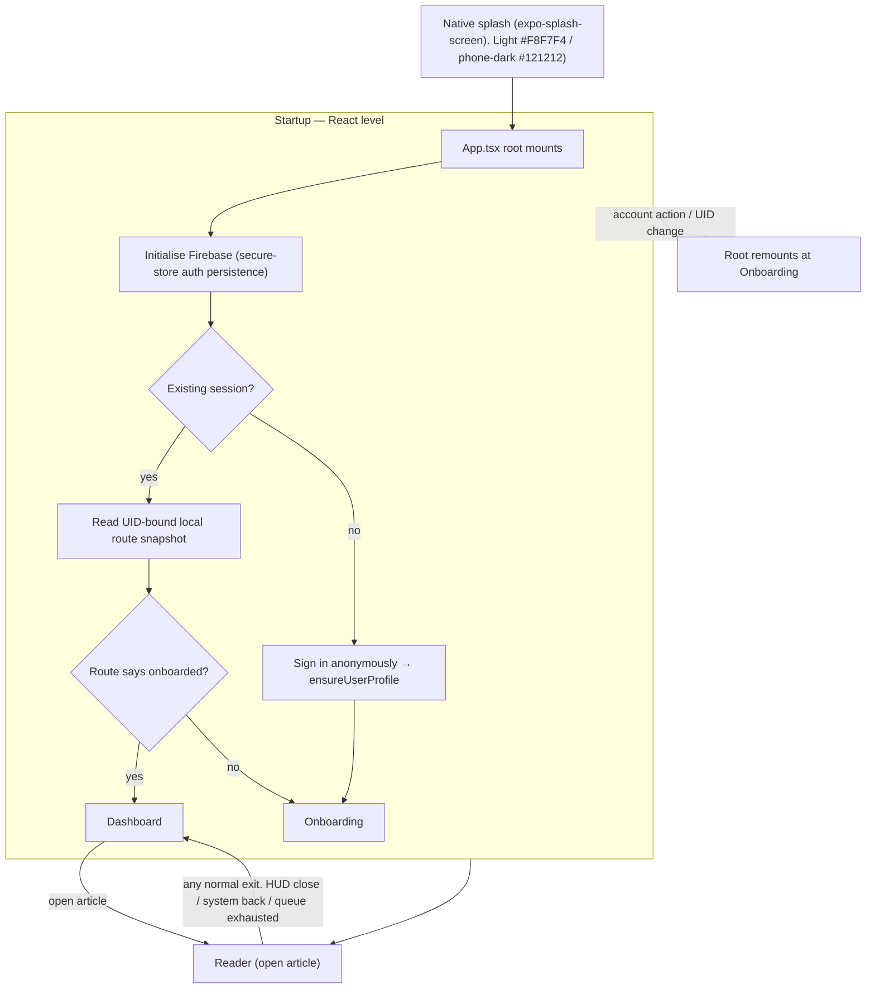

# Tangent — Visual Guide to How the App Works

> **What this folder is:** picture-based guides to every part of the app. Each feature
> gets one file: a flowchart/sequence diagram at the top, then **"Key details — nothing
> left out"** bullets with the exact numbers, thresholds, keys, and fallbacks, then
> **"Where this lives"** pointers to the real source files so you can verify anything.
>
> These files are a *translation* of `docs/architecture.md`, `docs/system-patterns.md`,
> and `docs/tech-context.md` into diagrams — they don't replace or change those docs.


## The whole app at a glance



> **Note on the subtlety:** the startup *always* runs one shared ranked-feed request when there is
> no healthy cached feed, and Background verification (profile stats, fresh feed,) runs *while*
> cached cards already render. "Ready to show cards" and "cloud verification finished"
> are deliberately **not** the same moment — see `03-dashboard-feed.md`.

---

## Index of the flow files

| # | File | What it shows |
|---|---|---|
| — | `README.md` | Whole-app map + this index |
| 01 | `01-startup-and-auth.md` | Launch → identity restore → route choice → account transitions |
| 02 | `02-onboarding-and-preferences.md` | Category pick → save-before-navigate → shared first-feed handoff; prefs screens |
| 03 | `03-dashboard-feed.md` | Dashboard card lifecycle: request → render → cache → refresh (phone-side — the server pipeline is 04) |
| 04 | `04-article-journey.md` | **The one big lifecycle:** an article's full trip through the backend (find → parse → save → pool → score → select → send) + the user-actions loop that changes weights |
| 05 | `05-ranking-algorithm.md` | The abstract maths visualised: P/T/R/Q, sigmoid, greedy selector, penalties, formula |
| 06 | `06-weight-learning.md` | Event → classify → delta (×Engagement Index)→ watermark → drift → UI thresholds |
| 07 | `07-reader.md` | Article open path, WebView, gestures, HUD, Android native preloader, exit paths |
| 08 | `08-behavior-sync-offline.md` | Event queue → offline manager → sync callable → validate → classify → update |
| 09 | `09-analytics.md` | client_id → GA4 Measurement Protocol → BigQuery → Looker; full event list |
| 10 | `10-account-management.md` | Anonymous / Google link / sign out / reset / delete + orphan recovery |
| 11 | `11-cloud-functions-schedule.md` | The 14 Cloud Functions + cron schedules |
| 12 | `12-data-and-security.md` | AsyncStorage keys + Firestore collections + security rules flow |

---

## Legend (used in every file)

- **Solid arrow** = normal data/control flow
- **Dashed arrow** = optional / conditional path
- **Red text / red fill** = failure, error, or blocked path
- **Rounded box** = start / end-state or process
- **Diamond** = a decision (yes goes to one branch, no to the other)

---

## How to read a scoring-formula box

Scores use **one formula** (v2 sigmoid/latent model). The four components each output
`[0, 1]`, then get weighted:

```
fullScore = 0.60·P + 0.15·T + 0.10·R + 0.15·Q
```

Everything that goes into that number is drawn in `05-ranking-algorithm.md`; how that
score turns into learning is in `06-weight-learning.md`. Reading events never touch the
formula directly — they update the *latents* (`catLatent`, `pubLatent`, `publisherLatent`,
`S` for trending) that the formula reads:

```
P = w_cat·σ(catLatent) + w_pub·σ(pubLatent)        σ(x) = 1/(1+e^-x)
Q = σ(publisherLatent)
T = S / (S + k),  k = 25                      R = 1/(1 + daysOld/τ), τ = 14
```

That separation — **"behaviour changes numbers; the numbers change the feed"** — is what
`05` and `06` are really about.

---