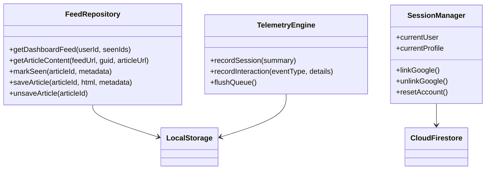
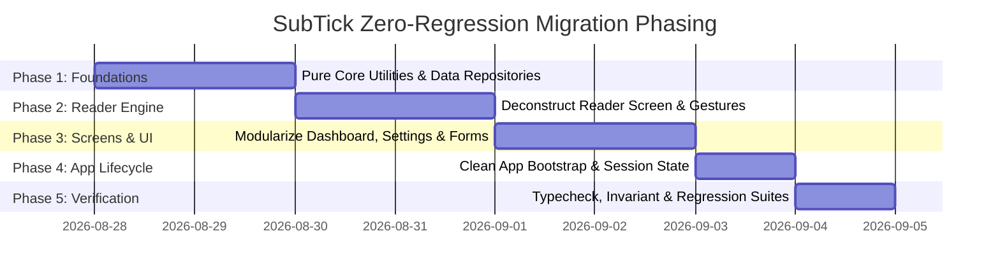

# Complete Architectural Migration & Refactoring Plan: SubTick Mobile

## Executive Summary & Migration Philosophy

SubTick (Tangent) is an offline-first, AI-ranked RSS reading application built with React Native / Expo, Firebase, and a custom Android native RSS parser. Over successive iterations, feature additions, and hotfixes, the codebase accumulated severe technical debt characterized by:
- **Layered defensive caches & mutexes** fighting for custody of the feed and event queue.
- **Tree-remounting hacks** (using arbitrary integer keys to forcibly reset React trees).
- **Giant "God" components** mixing WebView DOM script string injections, gesture zones, analytics telemetry, and data fetching.
- **Fragmented storage conventions** split across five disconnected cache files and raw AsyncStorage keys.

This document presents a **complete, zero-regression architectural migration blueprint** to migrate the existing codebase into a clean, modern, maintainable, and type-safe architecture while guaranteeing **100% feature parity**, preserving all business logic (WPM calibration, engagement scoring, rolling weekly metrics, offline saves, paywall skips, and transition safety).

---

## Technical Audit vs. Project Manager Translation

| Technical Issue in Current Codebase | Non-Technical PM Translation |
| :--- | :--- |
| **5 Caching Layers with `createStorageMutex`**: `startupCache.ts`, `dashboardFeedCache.ts`, `initialDashboardFeed.ts`, `feedSessionCache`, and `NativeRssParser` hold duplicate copies of feeds and seen article IDs. | **Too Many Filing Cabinets**: When the app opens, it checks 5 different temporary notebooks to figure out what articles to show. If one notebook gets out of sync with another, articles can flicker, duplicate, or disappear. We are consolidating this into a single, organized filing system. |
| **Navigation Key Bumping (`navKey += 1`)**: Switching users or resetting an account forces React Native to destroy and rebuild every screen in memory. | **Demolishing the House to Change the Locks**: When a user logs in or resets their account, instead of simply updating the user profile on screen, the app crashes and rebuilds the entire visual structure from scratch. We will make the app smoothly update its state without destruction. |
| **Monolithic `ReaderScreen.tsx` (~860 lines) with Inlined Injected JS**: Injects multi-hundred-line JavaScript strings into `react-native-webview` alongside PanResponder edge drag listeners and HUD state. | **A Chef Doing Table Service and Cooking**: The reading screen is trying to do everything at once: track finger swipes on the screen edges, manage floating menus, download articles, measure reading speed, and inject web scripts. We will split this into specialized, independent helpers. |
| **Brittle Source-String Test Invariants**: Test scripts assert exact raw string matches on source files rather than behavioral black-box unit tests. | **Inspecting the Blueprint Font Instead of Testing the Building**: Some existing tests check whether exact phrases exist in the source code rather than testing whether the app actually works. We will ensure proper behavioral and regression coverage. |

---

## Current Architecture vs. Target Architecture

```mermaid
graph TD
    subgraph Current Architecture [Current: Patch-Accreted Spaghetti]
        AppCurrent[App.tsx - Key Bumps, Anim Sync, Feed Preload] --> NavCurrent[RootNavigator.tsx]
        AppCurrent --> Cache1[startupCache.ts]
        AppCurrent --> Cache2[dashboardFeedCache.ts]
        AppCurrent --> Cache3[initialDashboardFeed.ts]
        NavCurrent --> DashCurrent[DashboardScreen.tsx - 540 lines: Subscriptions, Refs, Mutexes]
        NavCurrent --> ReadCurrent[ReaderScreen.tsx - 860 lines: Webview JS strings, PanResponder, HUD]
        DashCurrent --> FeedSvcCurrent[feedService.ts - 660 lines: RSS, XSS, Firestore, Storage]
        ReadCurrent --> FeedSvcCurrent
        ReadCurrent --> BSyncCurrent[behaviorSync.ts - Mutexes, Offline Queue]
    end

    subgraph Target Architecture [Target: Clean Layered Architecture]
        AppNext[App.tsx - Clean Root Shell] --> AuthCtx[Session / Auth Context]
        AppNext --> ThemeCtx[Theme Context]
        AuthCtx --> RootNav[Root Navigation Stack]
        
        RootNav --> Dashboard[Dashboard Module: Feed Hooks + Metric Cards]
        RootNav --> ReaderModule[Reader Engine: Decoupled WebView + Gesture Hook + HUD]
        
        Dashboard --> FeedRepo[Unified Feed & Content Repository]
        ReaderModule --> FeedRepo
        ReaderModule --> TelemetryRepo[Unified Behavior & Telemetry Engine]
        
        FeedRepo --> LocalStorage[Encrypted / Serialized Storage Adapter]
        FeedRepo --> RSSBridge[RSS Engine: Native Bridge + JS Fallback]
        FeedRepo --> CloudFirestore[Firebase Firestore & Cloud Functions]
        TelemetryRepo --> LocalStorage
        TelemetryRepo --> CloudFirestore
    end
```



---

## Detailed Subsystem-by-Subsystem Migration Plan



---

### Subsystem 1: Application Lifecycle & Visual Startup

#### Technical Audit & Line-by-Line Mechanics
- **Files**: [App.tsx](file:///c:/2SubTick/App.tsx), [StartupScreen.tsx](file:///c:/2SubTick/src/components/StartupScreen.tsx), [ThemeContext.tsx](file:///c:/2SubTick/src/contexts/ThemeContext.tsx)
- **Current Mechanics**:
  - `App.tsx` coordinates `startupTypingComplete`, `startupPreparationComplete`, and `startupSequence` using state counters.
  - Checks `getStartupSnapshot(user.uid)` from AsyncStorage before Firestore initializes.
  - Listens to `subscribeToAccountTransition` and bumps a global `navKey` integer on every account change to force a full tree recreation.
  - `ThemeContext.tsx` generates a 110-line CSS string (`webViewCSS`) injected into WebViews to style text and prevent theme switching flashes.

#### Proposed Target Design
- **Clean App Shell**: `App.tsx` initializes global providers (`ThemeProvider`, `AuthProvider`, `FeedProvider`, `GestureHandlerRootView`, `ErrorBoundary`).
- **Coordinated Startup Gateway**: A dedicated `AppBootstrap` component handles initial anonymous auth restoration and displays `StartupScreen` until both typing animation (`MOTTO = 'sapere aude'`) and minimal auth readiness complete.
- **No Remount Keys**: Replace `navKey` with declarative React state (`activeSessionId` / auth status) so navigation updates smoothly.

#### PM Non-Technical Summary
> **Startup Experience**: When a user opens the app, the app immediately shows the elegant "TANGENT: sapere aude" typing animation while logging the user in silently in the background. Once ready, it smoothly slides into the home feed without jumping or glitching.

---

### Subsystem 2: Identity, User Profile & Session Management

#### Technical Audit & Line-by-Line Mechanics
- **Files**: [auth.ts](file:///c:/2SubTick/src/services/auth.ts), [accountTransition.ts](file:///c:/2SubTick/src/services/accountTransition.ts), [UserContext.tsx](file:///c:/2SubTick/src/contexts/UserContext.tsx), [AccountScreen.tsx](file:///c:/2SubTick/src/screens/AccountScreen.tsx)
- **Current Mechanics**:
  - `ensureUserProfile`: Initializes default category weights (0.5 neutral, 1.2 selected, 0.1 not interested), streak stats, WPM baseline (200), and dashboard metric slots.
  - `linkGoogleAccount`: Handles linking Google credential to anonymous UID; if already in use, generates a 96-bit random hex `orphanTransferToken`, stamps it into the anonymous Firestore profile, logs in as the existing user, and calls Cloud Function `deleteOrphanProfile` to clean up the abandoned anonymous record.
  - `UserContext`: Real-time Firestore snapshot listener for `users/{userId}`, plus a rolling 7-day listener on `users/{userId}/behavior_events` to compute `weeklyReadCount` with an hourly decay timer (`setInterval`).
  - Implements `applyProvisionalSession`: Computes instantaneous optimistic UI updates for streak, total reads, reading time, and calibrated WPM (within `[MIN_PLAUSIBLE_WPM (80), MAX_PLAUSIBLE_WPM (1200)]` on `>= 60` words) so the user sees their stats increment immediately before server functions complete.

#### Proposed Target Design
- **Unified Auth & Profile Store**: Create a clean `AuthService` domain module with explicit methods for anonymous authentication, Google linking, account recovery with orphan cleanup tokens, and account reset/deletion.
- **Optimistic State Reducer**: Keep `applyProvisionalSession` math in a pure utility module (`src/domain/metrics/calculations.ts`) with 100% mathematical parity to backend rules.

#### PM Non-Technical Summary
> **User Accounts & Data Safety**: Users can start reading immediately without signing up. If they later link their Google account, all their reading history, streaks, and saved preferences are preserved. If they switch devices, their data is seamlessly recovered. Stats update instantly on their screen the moment they finish an article.

---

### Subsystem 3: Feed Recommendation, Storage & Offline Pipeline

#### Technical Audit & Line-by-Line Mechanics
- **Files**: [feedService.ts](file:///c:/2SubTick/src/services/feedService.ts), [dashboardFeedCache.ts](file:///c:/2SubTick/src/services/dashboardFeedCache.ts), [startupCache.ts](file:///c:/2SubTick/src/services/startupCache.ts), [initialDashboardFeed.ts](file:///c:/2SubTick/src/services/initialDashboardFeed.ts), [offlineManager.ts](file:///c:/2SubTick/src/services/offlineManager.ts), [asyncStorageMutex.ts](file:///c:/2SubTick/src/services/asyncStorageMutex.ts), [behaviorSync.ts](file:///c:/2SubTick/src/services/behaviorSync.ts)
- **Current Mechanics**:
  - `getRankedFeed`: Calls Cloud Function `getRankedFeed` with the user's `seenArticleIds` (capped at 1,000 in AsyncStorage). Falls back to a direct Firestore query (`isPaywalled == false`, `rssStatus == 'current'`, `publishDate desc`) if the Cloud Function fails.
  - RSS Extraction: Checks Android native parser (`NativeRssParser`); if unavailable (iOS/Dev Client), falls back to `fast-xml-parser` with 15s timeout `AbortController`.
  - Client-Side Sanitizer (`sanitizeClientHtml`): Uses `xss` library whitelist plus regexes stripping tracking pixels, empty dimensions, paywall overlays, and subscription widgets.
  - Seen & Saved Articles:
    - Seen IDs capped at 1,000 locally, synced to Firestore via `arrayUnion`.
    - Saved articles store complete HTML locally (`@subtick_saved_html_{id}`) and mirror metadata to Firestore subcollection `users/{uid}/saved_articles/{id}`.
    - If offline during save, saves are queued in `PENDING_SAVE_MIRRORS_KEY` and retried upon NetInfo reconnect by `offlineManager.ts`.
  - Behavior Telemetry Queue (`behaviorSync.ts`):
    - Queues interactions in `BEHAVIOR_QUEUE_KEY` (capped at 200).
    - Serialized via `createStorageMutex`.
    - Batches of 20 sent to Cloud Function `syncBehaviorEvents`.

#### Proposed Target Design
- **Consolidated `FeedRepository`**: Replace the separate `startupCache.ts`, `dashboardFeedCache.ts`, and `initialDashboardFeed.ts` files with a single unified, thread-safe Feed Repository.
- **Isomorphic Content Extractor**: Separate the RSS fetching and sanitization logic into pure, testable modules (`rssParser.ts` and `htmlSanitizer.ts`).
- **Unified Offline Sync Engine**: Single background sync coordinator managing both the behavior telemetry queue and pending saved article mirrors upon network reconnection with 30s retry backoff.

#### PM Non-Technical Summary
> **Smart Feed & Offline Capability**: The app downloads stories and caches them so reading is instant and works completely offline (e.g. on the subway or in airplane mode). Bookmarked articles are saved permanently on the device. User reading habits (time spent, scroll depth) are queued locally and synced silently when connected.

---

### Subsystem 4: Reader Screen & Reading Experience

#### Technical Audit & Line-by-Line Mechanics
- **Files**: [ReaderScreen.tsx](file:///c:/2SubTick/src/screens/ReaderScreen.tsx), [useArticleLoader.ts](file:///c:/2SubTick/src/features/reader/useArticleLoader.ts), [useNavigationQueue.ts](file:///c:/2SubTick/src/features/reader/useNavigationQueue.ts), [useReaderHUD.ts](file:///c:/2SubTick/src/features/reader/useReaderHUD.ts), [useBehaviorTracker.ts](file:///c:/2SubTick/src/hooks/useBehaviorTracker.ts), [ReaderHUD.tsx](file:///c:/2SubTick/src/features/reader/ReaderHUD.tsx), [ReaderProgressBar.tsx](file:///c:/2SubTick/src/features/reader/ReaderProgressBar.tsx)
- **Current Mechanics**:
  - `ReaderScreen.tsx`: Hosts `react-native-webview` inside a full-screen view.
  - Gestures: PanResponder handles horizontal swipes. Left edge (`x < 32`) reveals system navigation bars for native back; edge band (`x < 45` or `x > width - 45`) swipe over 40px advances/rewinds the queue.
  - Injected Script (`makeReaderScript`): Scans DOM for `#tangent-article` or semantic selectors (`article`, `main`), calculates word count, tracks scroll depth relative to article body, reports progress via `postMessage`.
  - HUD: Toggles on tap; auto-hides after delay. Provides Like, Bookmark/Save, Open in Browser (`Linking.openURL`), and Close buttons.
  - Active Session Timing: Pauses when app goes to background (`AppState !== 'active'`) and resumes on foreground; calculates real reading duration.
  - Preloading: Prefetches upcoming 2-3 queue articles in background using native thread or XML parser so swiping to next article is instant.
  - Paywall / Archived Fallback: If live RSS is unavailable, respects `includeArchivedArticles` setting; if off, silently skips unavailable items without breaking queue.

#### Proposed Target Design
- **Extracted WebView Controller**: Move the entire DOM extraction and scroll measurement script into a static file (`readerScript.js`) with unit tests.
- **Hook-Driven Gestures (`useReaderGestures`)**: Extract all PanResponder logic and edge detection calculations into a clean custom hook.
- **Clean Component Architecture**: `ReaderScreen` becomes an orchestrator under 180 lines:
  ```tsx
  <ReaderContainer>
    <ReaderWebView content={html} onMessage={handleWebViewMessage} />
    <ReaderProgressBar progress={scrollProgress} />
    <ReaderHUD visible={hudVisible} onAction={handleHudAction} />
  </ReaderContainer>
  ```

#### PM Non-Technical Summary
> **The Reader Experience**: When a user reads an article, the interface is completely distraction-free with no clutter or popups. Swiping from the right edge moves smoothly to the next recommended article. The app tracks how far they read and how fast they read without draining battery or lagging the interface.

---

### Subsystem 5: Screen Suite & Navigation

#### Technical Audit & Line-by-Line Mechanics
- **Screens**:
  1. [DashboardScreen.tsx](file:///c:/2SubTick/src/screens/DashboardScreen.tsx): Editorial card layout, 3 customizable stats cards, pull-to-refresh, shuffle button (`Surprise Me`).
  2. [OnboardingScreen.tsx](file:///c:/2SubTick/src/screens/OnboardingScreen.tsx): Category selection chip grid (Selected / Neutral / Not Interested).
  3. [SettingsScreen.tsx](file:///c:/2SubTick/src/screens/SettingsScreen.tsx): Modal menu with theme switcher, archived toggle, links to sub-screens.
  4. [DashboardStatsScreen.tsx](file:///c:/2SubTick/src/screens/DashboardStatsScreen.tsx): Select 3 of 6 stats metrics for dashboard display.
  5. [CategoryPreferencesScreen.tsx](file:///c:/2SubTick/src/screens/CategoryPreferencesScreen.tsx): Fine-tune category interests with instant auto-save.
  6. [HistoryScreen.tsx](file:///c:/2SubTick/src/screens/HistoryScreen.tsx) & [SavedReadsScreen.tsx](file:///c:/2SubTick/src/screens/SavedReadsScreen.tsx): Use shared [ArticleListScreen.tsx](file:///c:/2SubTick/src/components/ArticleListScreen.tsx) for fast offline list display.
  7. [FeedbackScreen.tsx](file:///c:/2SubTick/src/screens/FeedbackScreen.tsx) & [FeedRequestScreen.tsx](file:///c:/2SubTick/src/screens/FeedRequestScreen.tsx): Modal form screens writing to Firestore collections.
  8. [DeveloperOptionsScreen.tsx](file:///c:/2SubTick/src/screens/DeveloperOptionsScreen.tsx): URL sandbox tester and storage reset button.

#### Proposed Target Design
- Reusable UI component library (`Card`, `Header`, `Button`, `Chip`, `FormScreen`, `StatPill`).
- Eliminate code duplication between `History` and `SavedReads`.
- Fully strongly typed navigation parameters (`RootStackParamList`).

#### PM Non-Technical Summary
> **User Interface & Settings**: A cohesive, minimal, high-end editorial UI. All sub-screens (reading history, bookmarks, category preferences, stats configuration, feedback) load immediately without blank white flashes.

---

### Subsystem 6: Native Android Module & Backend Compatibility

#### Technical Audit & Line-by-Line Mechanics
- **Native Module**: [modules/tangent-rss-parser/](file:///c:/2SubTick/modules/tangent-rss-parser) (Kotlin implementation `TangentRssParserModule.kt`).
  - Preloads raw RSS feeds off the JS thread in bounded Android thread pools.
  - Resolves articles by `guid` or permalink `link`.
- **Firebase Functions & Firestore Rules**:
  - Functions: `getRankedFeed`, `syncBehaviorEvents`, `deleteOrphanProfile`, `resetAccount`, `deleteAccount`.
  - Security Rules: Owner-only access on `users/{userId}/**`, read-only on `articles/**`, write-only on `feedback` and `feed_requests`.

#### Proposed Target Design
- Maintain 100% exact interface compatibility with `NativeRssParser` and Firebase Cloud Functions contract.

#### PM Non-Technical Summary
> **Platform & Cloud Reliability**: The app's custom Android engine parses news feeds rapidly in the background so the phone remains responsive and snappy. All interactions match the cloud database rules precisely.

---

## Zero-Regression Verification & Test Plan

To guarantee that the migration introduces **zero functional regressions**, the migration will be validated against:

1. **Algorithm & Metric Invariants**:
   - Rolling 7-day weekly reading count logic.
   - WPM speed calibration bounds: `[80, 1200]` WPM on articles $\ge 60$ words.
   - Reading engagement classification (Finished $\ge 70\%$, Qualifying/Streak $\ge 40\%$).
   - Dashboard metric normalization (unique, max 3 slots).
2. **Offline & Sync Invariants**:
   - Seen articles capped at 1,000 in storage.
   - Saved articles fully offline with full HTML stored locally.
   - Failed save mirrors and behavior events queued and flushed on NetInfo reconnect.
3. **Type Safety & Build Checks**:
   - `npm run typecheck` passes with zero TypeScript errors across app and functions.
   - Native module autolinking verification.

---

## Migration Phase Roadmap



---

## User Review & Approval Required

Please review this plan. Upon your approval, we will proceed systematically through the phases without making premature breaking changes.
